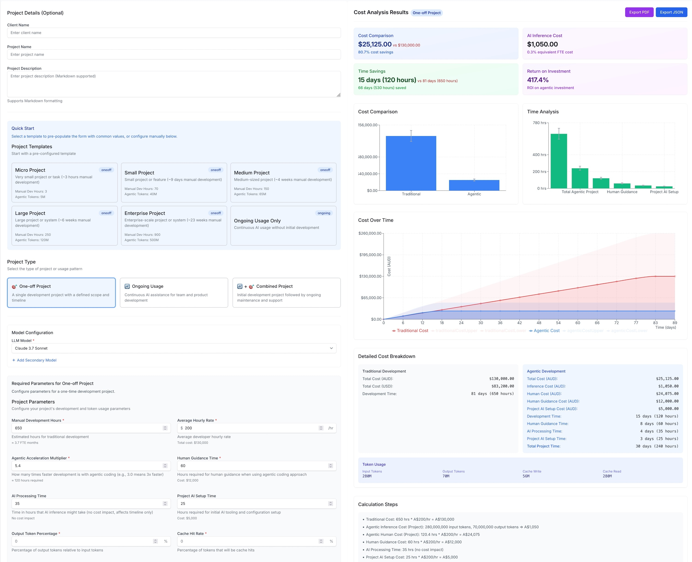
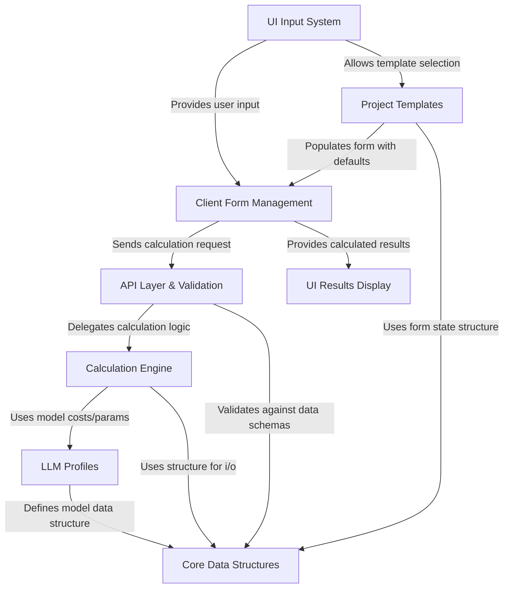
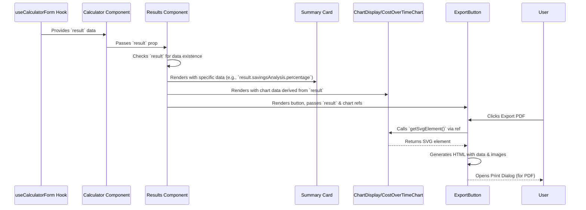

# Agentic Cost Calculator

This project is a web application designed to help users *estimate* and *compare* the costs and timelines of software development projects.

It contrasts the **traditional** development approach with a modern **agentic** approach (using AI assistance).
Users input project details, choose AI models, and the application calculates potential costs, time savings, and other metrics, presenting them in an easy-to-understand format with charts and summaries.

## Features

### Two Interface Modes

- **Guided Mode (Wizard)** - Step-by-step interface perfect for new users, with persistent progress and auto-advancing selections
- **Advanced Mode** - Single-page form for power users who want direct access to all options

### Key Capabilities

- **Project Templates** - Pre-configured settings for common project types (web apps, APIs, mobile apps, etc.)
- **Multi-Model Support** - Choose from Claude, OpenAI, DeepSeek, Gemini, and Amazon Nova models
- **Persistent State** - Progress automatically saved across browser sessions
- **Real-time Calculations** - Instant cost and time estimates as you input parameters
- **Export Functionality** - Save results as PDF or JSON for sharing and record-keeping
- **Responsive Design** - Works seamlessly on desktop, tablet, and mobile devices

- [Agentic Cost Calculator](#agentic-cost-calculator)
  - [Features](#features)
    - [Two Interface Modes](#two-interface-modes)
    - [Key Capabilities](#key-capabilities)
  - [Usage](#usage)
    - [Interface Modes](#interface-modes)
    - [Testing](#testing)
  - [Architecture Overview](#architecture-overview)
  - [UI Flow](#ui-flow)



## Usage

```shell
git clone --depth=1 https://github.com/sammcj/agentic_crossover.git
cd agentic_crossover
pnpm i
pnpm dev
```

Then open http://localhost:3000 in your browser.

### Interface Modes

The application offers two distinct user experiences:

**Guided Mode (Default)**

- Step-by-step wizard interface with 7 clear stages: Welcome → Use Case → Template → Model → Parameters → Review → Results
- Auto-advancing selections for template and model choices
- Persistent progress saved automatically to localStorage
- "Start Over" button readily available for quick resets
- Consolidated navigation bar with app title, controls, and progress indicator
- Perfect for first-time users or when you want a structured approach

**Advanced Mode**

- Single-page form with all options visible at once
- Direct access to all parameters and settings
- Ideal for power users who know exactly what they want to configure
- Switch between modes anytime using the "Advanced Mode" toggle

You can also query the API:

```shell
curl -X POST http://localhost:3001/api/calculate -H "Content-Type: application/json" -d '{
  "projectType": "oneoff",
  "globalParams": {
    "currencyRate": 0.64,
    "aiCapabilityFactor": 1.0,
    "totalCostMultiplier": 1.0
  },
  "modelConfig": {
    "primaryModelId": "claude_4_0_sonnet"
  },
  "projectParams": {
    "manualDevHours": 160,
    "agenticMultiplier": 3.0,
    "inputOutputTokenRatio": 20,
    "cachedTokenRatio": 80,
    "totalProjectTokens": 80000000,
    "averageHourlyRate": 200,
    "humanGuidanceTime": 0.5,
    "outputTokenPercentage": 80,
    "cachedTokenPercentage": 80
  }
}'|jq
```

which will return something like:

```json
{
  "disclaimerText": "Estimates are based on industry standards for the gains seen from Agentic software development and token usage to support the calculations. Actual results will vary for each specific use case and implementation.",
  "traditionalCost": {
    "usd": 20480,
    "aud": 32000
  },
  "traditionalTime": 160,
  "agenticCost": {
    "inference": {
      "usd": 232.8,
      "aud": 364
    },
    "human": {
      "usd": 6826,
      "aud": 10667
    },
    "total": {
      "usd": 7059,
      "aud": 11031
    }
  },
  "agenticTime": 53,
  "humanGuidanceCost": {
    "usd": 64,
    "aud": 100
  },
  "humanGuidanceTime": 0.5,
  "totalProjectTime": 53,
  "tokenUsage": {
    "input": 16000000,
    "output": 64000000,
    "cacheWrite": 3200000,
    "cacheRead": 64000000,
    "effectiveTotal": 80000000
  },
  "savingsAnalysis": {
    "cost": {
      "usd": 13420,
      "aud": 20970
    },
    "percentage": 65,
    "timeInHours": 106,
    "roi": 190.10690137120838
  },
  "fteEquivalentCost": {
    "usd": 20480,
    "aud": 32000
  },
  "visualisationData": [
    {
      "name": "Traditional Cost",
      "value": 32000,
      "errorMargin": 3200
    },
    {
      "name": "Agentic Cost",
      "value": 11031,
      "errorMargin": 1103
    },
    {
      "name": "Human Guidance Cost",
      "value": 100,
      "errorMargin": 10
    },
    {
      "name": "Monthly FTE Cost",
      "value": 32000,
      "errorMargin": 3200
    }
  ],
  "calculations": [
    "Traditional Cost: 160 hrs * A$200/hr = A$32,000",
    "Agentic Inference Cost (Project): 16,000,000 input tokens, 64,000,000 output tokens => A$364",
    "Agentic Human Cost (Project): 53.3 hrs * A$200/hr = A$10,667",
    "Human Guidance Cost: 0.5 hrs * A$200/hr = A$100",
    "Total Project Time: 53.8 hrs"
  ]
}
```

### Testing

```shell
pnpm test
```

---

## Architecture Overview



## UI Flow


