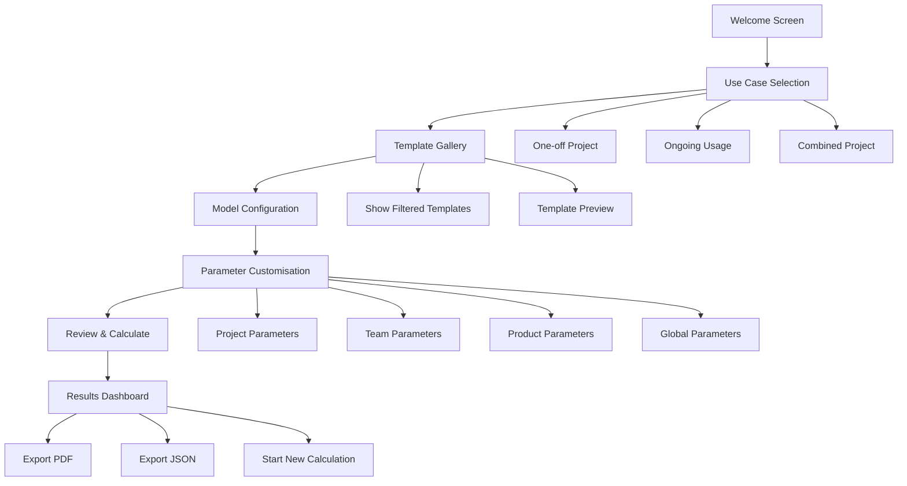
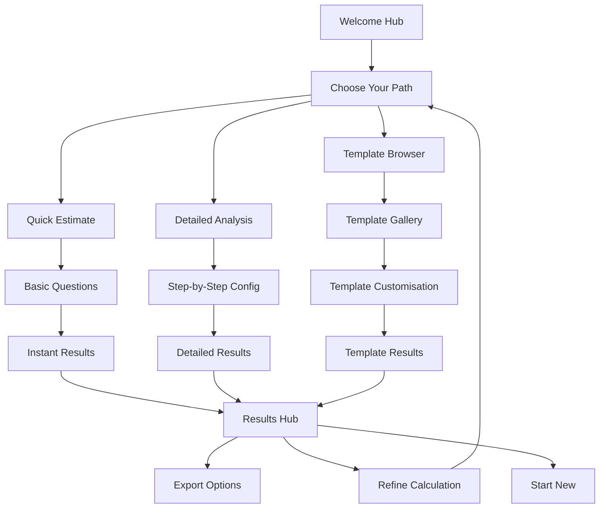
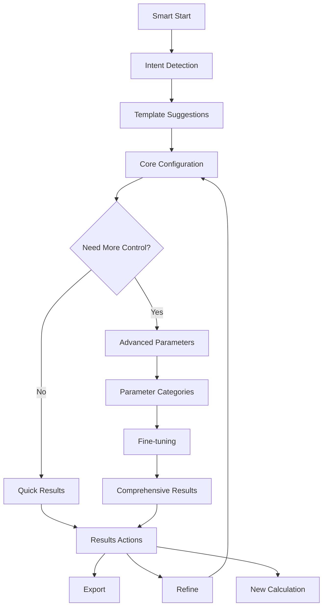

# UI Uplift Project Discovery

## 🎯 Current Implementation Status

**Phase 1 & 2: COMPLETED ✅**
- All core wizard framework components implemented
- All 7 wizard steps fully functional (Welcome → Use Case → Template → Model → Parameters → Review → Results)
- Complete step validation and navigation system
- Full integration with existing calculation engine
- Comprehensive unit tests passing (43/43 tests)

**Ready for Phase 3: Enhanced UX & Polish**
- Template preview enhancements
- Smart defaults and pre-population
- Advanced mode toggle
- UI polish and accessibility improvements

## Project Context

This document outlines the discovery and planning for improving the user experience flow of the Agentic Cost Calculator application. The current interface has several usability issues that need to be addressed while maintaining the existing calculation logic and template system architecture.

## Current State Analysis

### Existing Issues

- **Clunky Template Selection**: Templates are buried within the form as a "Quick Start" section rather than being prominently featured
- **Confusing Parameter Split**: The division between one-off projects, ongoing usage, and combined scenarios creates user confusion
- **No Guided Journey**: Users are presented with a complex form immediately without guidance on what they're trying to achieve
- **Poor Information Architecture**: All form fields are visible at once, overwhelming new users

### Current Application Structure

The application currently uses:

- Single-page form with all parameters visible
- Side-by-side input panel and results display
- Template system separate from main code (good for future extensibility)
- Robust calculation engine and API
- Comprehensive form state management via `useCalculatorForm` hook

## Requirements

### Functional Requirements

1. **Guided User Journey**: Create a step-by-step experience that helps users understand what they're calculating
2. **Template-First Approach**: Make templates prominent with clear examples and use cases
3. **Progressive Disclosure**: Show complexity only when needed
4. **Maintain All Features**: Preserve all current calculation capabilities
5. **Export Functionality**: Keep PDF/JSON export options
6. **Template Extensibility**: Maintain separation for future community contributions

### Technical Requirements

1. **Preserve Calculation Logic**: No changes to existing calculation engine
2. **Maintain API Compatibility**: Keep existing server endpoints
3. **Code Maintainability**: Keep implementation simple and robust
4. **Accessibility**: Ensure wizard is accessible and responsive
5. **Performance**: No degradation in calculation performance

### Future Considerations

1. **Community Templates**: Easy submission and management of new templates
2. **User Feedback Integration**: Ability to collect post-project data for template improvement
3. **Template Analytics**: Understanding which templates are most popular/effective

## Proposed Solution: Guided Wizard Flow

### Selected Approach: Linear Step-by-Step Wizard

We've chosen a linear wizard approach as it provides the clearest user experience while being the most straightforward to implement.

#### User Flow Diagram



### Alternative Approaches Considered

#### Option B: Hub-and-Spoke Wizard



**Pros**: Multiple entry points, flexible navigation, accommodates different user types
**Cons**: More complex implementation, potential confusion, sophisticated state management required

#### Option C: Progressive Disclosure Wizard



**Pros**: Adapts to user expertise, maintains simplicity, preserves power user functionality
**Cons**: Complex branching logic, unpredictable user journey, may hide important options

### Pros and Cons of Selected Approach (Linear Wizard)

#### Pros

- **Clear, Predictable Flow**: Users always know what comes next
- **Easy Implementation**: Can reuse existing form state and validation logic
- **Good for First-time Users**: Each step has a single focus
- **Maintainable**: Simple state management and navigation logic
- **Accessible**: Linear flow is easier to make accessible
- **Testable**: Each step can be tested independently

#### Cons

- **May Feel Lengthy**: Experienced users might want to skip steps
- **Less Flexible**: Harder to jump between non-sequential steps
- **Power User Limitation**: Advanced users may find it restrictive

### Mitigation Strategies for Cons

1. **Progress Indicator**: Clear visual progress to set expectations
2. **Step Validation**: Allow users to skip ahead if previous steps are valid
3. **"Advanced Mode" Toggle**: Option to switch to current form-based interface
4. **Smart Defaults**: Pre-populate based on template selection to reduce steps
5. **Quick Actions**: "Use This Template" buttons that bypass customization

## Technical Implementation Plan

### Architecture Overview

#### New Component Structure

```
src/client/components/wizard/
├── WizardProvider.tsx          # Context for wizard state management
├── WizardStep.tsx             # Reusable step wrapper component
├── StepNavigation.tsx         # Progress indicator and navigation
├── steps/
│   ├── WelcomeStep.tsx        # Introduction and value proposition
│   ├── UseCaseStep.tsx        # Project type selection with explanations
│   ├── TemplateStep.tsx       # Template gallery with previews
│   ├── ModelStep.tsx          # Model selection and configuration
│   ├── ParametersStep.tsx     # Dynamic parameter forms
│   ├── ReviewStep.tsx         # Summary before calculation
│   └── ResultsStep.tsx        # Enhanced results with export options
└── hooks/
    ├── useWizardState.ts      # Wizard navigation and state
    └── useStepValidation.ts   # Step-by-step validation logic
```

#### Integration Strategy

- **Preserve Existing Logic**: Wrap existing `useCalculatorForm` hook
- **Template Compatibility**: Continue using `src/shared/utils/projectTemplates.ts`
- **API Compatibility**: No changes to calculation endpoints
- **Form State Bridge**: Create adapter between wizard state and existing form state

### Key Implementation Considerations

#### State Management

- Use React Context for wizard-specific state (current step, navigation history)
- Maintain existing form state structure for compatibility
- Implement step validation without breaking existing validation logic

#### Navigation

- Allow forward/backward navigation with state preservation
- Implement "skip ahead" logic for power users
- Handle browser back/forward buttons appropriately

#### Template Integration

- Enhance template display with card-based gallery
- Add template previews showing example calculations
- Maintain template separation for future community features

#### Responsive Design

- Ensure wizard works on mobile devices
- Consider step-specific mobile optimizations
- Maintain accessibility standards throughout

### Implementation Phases

#### Phase 1: Core Wizard Framework

1. Create `WizardProvider` and basic navigation
2. Implement `WizardStep` wrapper component
3. Build progress indicator component
4. Create wizard routing logic

#### Phase 2: Step Implementation

1. Convert existing forms to wizard steps
2. Implement template gallery step
3. Create welcome and review steps
4. Add step validation logic

#### Phase 3: Enhanced UX

1. Add template previews and examples
2. Implement smart defaults and pre-population
3. Create "advanced mode" toggle
4. Polish animations and transitions

#### Phase 4: Future Features

1. Template submission interface
2. User feedback collection
3. Analytics and usage tracking
4. Community template management

### Files Requiring Changes

#### New Files

- All files in `src/client/components/wizard/` directory
- Wizard-specific hooks and utilities

#### Modified Files

- `src/client/App.tsx` - Route to wizard instead of calculator
- `src/client/components/Calculator.tsx` - Add wizard/advanced mode toggle
- Existing form components - Make compatible with wizard steps

#### No Changes Required

- `src/shared/utils/calculations.ts` - Calculation logic preserved
- `src/shared/utils/projectTemplates.ts` - Templates remain separate
- `src/server/` - All server logic unchanged
- Existing validation and API code

### Testing Strategy

- Unit tests for each wizard step component
- Integration tests for wizard flow
- Ensure existing calculation tests continue to pass
- Add accessibility testing for wizard navigation

### Success Metrics

- Reduced time to first calculation for new users
- Increased template usage
- Higher completion rates for calculations
- Positive user feedback on experience clarity

## Conclusion

The Linear Wizard approach provides the best balance of user experience improvement and implementation simplicity. It addresses all identified user pain points while maintaining the robust architecture that supports future community contributions and template management features.

The implementation preserves all existing functionality while providing a significantly improved user journey that guides users from intention through to actionable results.

## Implementation Checklist

This checklist details the tasks required to implement the Linear Step-by-Step Wizard, based on the plan outlined above.

### Phase 1: Core Wizard Framework

- [x] **`WizardProvider.tsx` (New File: `src/client/components/wizard/WizardProvider.tsx`)**
  - [x] Define React Context for wizard state (current step, navigation history, shared form data).
  - [x] Integrate/wrap `useCalculatorForm` hook to manage the underlying form data structure.
  - [x] Expose functions to update wizard state and form data.
- [x] **`WizardStep.tsx` (New File: `src/client/components/wizard/WizardStep.tsx`)**
  - [x] Create a reusable wrapper component for individual wizard steps.
  - [x] Include props for step title, description, and content.
  - [x] Standardize layout for step content.
- [x] **`StepNavigation.tsx` (New File: `src/client/components/wizard/StepNavigation.tsx`)**
  - [x] Implement a visual progress indicator (e.g., step numbers, dots, or names).
  - [x] Create "Next" and "Previous" navigation buttons.
  - [x] Implement logic to update the current step in `WizardProvider` on button clicks.
  - [x] Disable/enable navigation buttons based on validation status or step position.
- [x] **Wizard Routing & Display Logic (Modify File: `src/client/App.tsx`)**
  - [x] Modify `src/client/App.tsx` to render the main wizard component as the default view.
  - [x] Implement logic within the main wizard component to display the correct `WizardStep` based on the current step state from `WizardProvider`.
- [x] **Wizard Hooks (New Files in `src/client/components/wizard/hooks/`)**
  - [x] **`useWizardState.ts`**: Develop a custom hook to easily access and manage wizard state (current step, form data) from `WizardProvider` within step components.
  - [x] **`useStepValidation.ts`**: Design the initial structure for a hook to manage step-specific validation logic. This hook will be populated with rules in Phase 2.

### Phase 2: Step Implementation & Content

- [x] **`WelcomeStep.tsx` (New File: `src/client/components/wizard/steps/WelcomeStep.tsx`)**
  - [x] Create the component for the wizard's introductory/welcome screen.
  - [x] Include a brief explanation of the calculator's purpose and value proposition.
- [x] **`UseCaseStep.tsx` (New File: `src/client/components/wizard/steps/UseCaseStep.tsx`)**
  - [x] Develop the component for selecting the project type (e.g., "One-off Project", "Ongoing Usage", "Combined Project").
  - [x] Provide clear explanations for each use case to guide user selection.
  - [x] Ensure selection updates the `projectType` field in the shared form data via `WizardProvider`.
- [x] **`TemplateStep.tsx` (New File: `src/client/components/wizard/steps/TemplateStep.tsx`)**
  - [x] Design and implement a template gallery UI (e.g., using cards for each template).
  - [x] Fetch and display available templates from `src/shared/utils/projectTemplates.ts`.
  - [x] Allow users to select a template.
  - [x] On template selection, apply its `defaultValues` to the shared form data.
  - [x] (Initial implementation of template previews, to be enhanced in Phase 3).
- [x] **`ModelStep.tsx` (New File: `src/client/components/wizard/steps/ModelStep.tsx`)**
  - [x] Create the component for AI model selection.
  - [x] Adapt or reuse logic from the existing `src/client/components/inputs/ModelSelector.tsx` if suitable.
  - [x] Ensure selection updates the `modelConfig` in the shared form data.
- [x] **`ParametersStep.tsx` (New File: `src/client/components/wizard/steps/ParametersStep.tsx`)**
  - [x] Design a dynamic form step to handle various parameter groups (Project, Team, Product, Global).
  - [x] Adapt existing form components (e.g., from `src/client/components/inputs/`) for use within this step. For example:
    - Global Parameters: Adapt `GlobalParametersForm.tsx` and parts of `ProjectDetailsForm.tsx` (for `customerName`, `projectName`, `projectDescription`).
    - Project Parameters: Adapt `ProjectParametersForm.tsx`.
    - Team Parameters: Adapt `TeamParametersForm.tsx`.
    - Product Parameters: Adapt `ProductParametersForm.tsx`.
  - [x] Conditionally display relevant parameter sections based on `projectType` and chosen template.
  - [x] Ensure all input fields correctly update their respective parts of the shared form data.
- [x] **`ReviewStep.tsx` (New File: `src/client/components/wizard/steps/ReviewStep.tsx`)**
  - [x] Create a component to summarize all user selections and configured parameters before calculation.
  - [x] Display key chosen values in a read-only format.
  - [x] Include a "Calculate" button that triggers the `handleSubmit` function (from the wrapped `useCalculatorForm`).
- [x] **`ResultsStep.tsx` (New File: `src/client/components/wizard/steps/ResultsStep.tsx`)**
  - [x] Adapt the existing `src/client/components/results/Results.tsx` component to display calculation results within the wizard.
  - [x] Ensure it correctly receives and displays the `result` data after calculation.
  - [x] Integrate existing export functionality (PDF/JSON via `ExportButton.tsx`).
  - [x] Add a "Start New Calculation" button to reset the wizard state and return to the `WelcomeStep`.
- [x] **Step Validation Implementation**
  - [x] Implement validation logic for each step using the `useStepValidation.ts` hook.
  - [x] Ensure users cannot proceed to the next step if the current step's required fields are invalid.
  - [x] Ensure validation messages are displayed appropriately within each step's UI, near the relevant fields, reusing existing error display patterns if possible.
  - [x] Leverage existing Zod schemas from `src/server/validation/schemas.ts` where applicable for data integrity.

### Phase 3: Enhanced UX & Polish

- [x] **Template Previews Enhancement**
  - [x] In `TemplateStep.tsx`, enhance template previews to show more details (e.g., example calculations, typical use cases, benefits).
  - [x] Implemented rich template gallery with card-based UI
  - [x] Added template-specific icons for visual identification
  - [x] Created expandable template cards with detailed information
  - [x] Added simplified cost estimation previews showing traditional vs agentic savings
  - [x] Included key benefits and use case recommendations for each template
  - [x] Implemented template filtering based on selected project type
  - [x] Added interactive features with hover effects and animations
  - [x] Maintained accessibility with proper ARIA labels and keyboard navigation
- [x] **Smart Defaults & Pre-population**
  - [x] Implement logic in `ParametersStep.tsx` to intelligently pre-populate form fields based on the selected template, reducing user input.
  - [x] Added smart project naming based on template parameters (e.g., "Quick Development Task", "Development Sprint", "Enterprise Development Initiative")
  - [x] Implemented intelligent customer name suggestions
  - [x] Created smart defaults info panel with toggle for advanced details
  - [x] Added context-aware project descriptions based on template selection
- [ ] **"Advanced Mode" Toggle (Modify File: `src/client/App.tsx` and `src/client/components/Calculator.tsx`)**
  - [ ] In `src/client/App.tsx` (or a new layout component), implement a UI toggle to switch between the new Wizard UI and the existing single-page form (`Calculator.tsx`).
  - [ ] Ensure `src/client/components/Calculator.tsx` can function as this "Advanced Mode".
  - [ ] Define behaviour for state transfer or reset when toggling modes. Consider how form state is synchronized or transferred if a user starts in the wizard, fills some data, and then switches to Advanced Mode, and vice-versa (a full state transfer might be simplest if the underlying `formState` is common).
- [ ] **UI Polish & Responsiveness**
  - [ ] Review and refine animations and transitions between wizard steps for a smooth user experience.
  - [ ] Ensure all wizard steps and new components are fully responsive across common device sizes (desktop, tablet, mobile).
- [x] **Accessibility (WCAG)**
  - [x] Conduct an accessibility review of the entire wizard flow.
  - [x] Ensure proper ARIA attributes, keyboard navigation, and focus management.
  - [x] Added proper navigation landmarks with semantic nav elements
  - [x] Implemented comprehensive ARIA labels and descriptions for all interactive elements
  - [x] Added screen reader support with sr-only hints and instructions
  - [x] Enhanced focus management and keyboard navigation throughout
- [x] **Navigation Enhancements**
  - [x] Ensure browser back/forward buttons work intuitively with wizard steps, preserving state where appropriate.
  - [x] Added URL-based step navigation with browser history integration
  - [x] Implemented keyboard shortcuts (Alt+Arrow keys) for wizard navigation
  - [x] Enhanced step navigation with progress indicators and visual feedback
  - [x] Added responsive navigation with mobile-friendly progress bars

### Testing Strategy Implementation

- [ ] **Unit Tests**
  - [ ] Write unit tests for each new wizard step component (e.g., `WelcomeStep.tsx`, `UseCaseStep.tsx`).
  - [ ] Write unit tests for new hooks (`useWizardState.ts`, `useStepValidation.ts`).
  - [ ] Write unit tests for `WizardProvider.tsx` state management and integration with `useCalculatorForm`.
- [ ] **Integration Tests**
  - [ ] Develop integration tests for the complete wizard flow: Welcome -> Use Case -> Template -> Model -> Parameters -> Review -> Results.
  - [ ] Test navigation logic (Next, Previous, conditional enabling).
  - [ ] Test data persistence and updates across wizard steps.
  - [ ] Test scenarios where users navigate back and forth between wizard steps, ensuring data persistence and correct re-population of fields.
  - [ ] Test the interaction between the wizard's "Calculate" action and the backend API via `useCalculatorForm`.
  - [ ] Test template application and its effect on pre-filling parameters, including edge cases like selecting a template, making modifications, then selecting another.
  - [ ] Test the "Advanced Mode" toggle and its interaction with the wizard.
- [ ] **Regression Tests**
  - [ ] Ensure all existing calculation tests in `src/shared/utils/__tests__/` continue to pass.
  - [ ] Verify that the "Advanced Mode" (if it reuses `Calculator.tsx`) maintains its original functionality and passes any associated tests.
