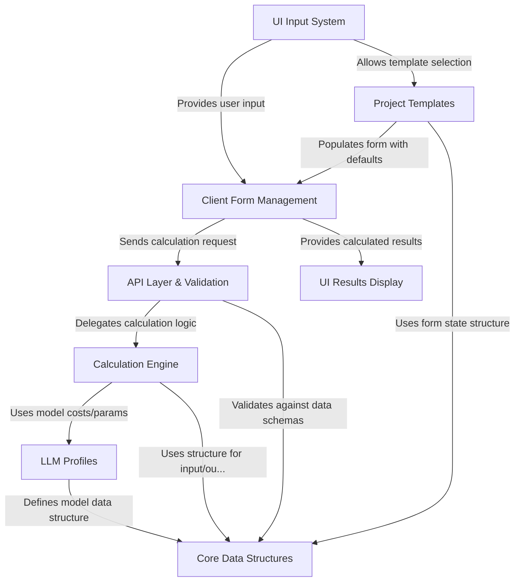
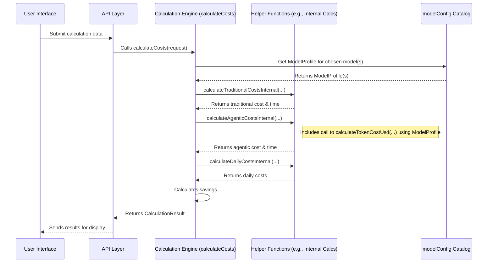
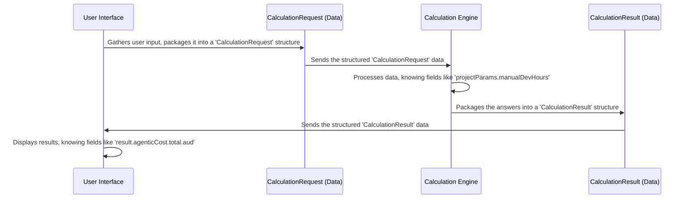
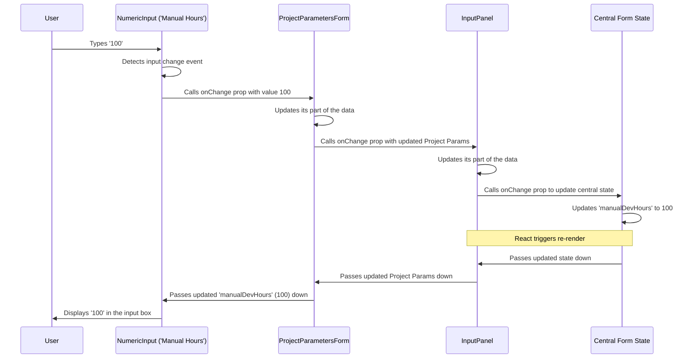
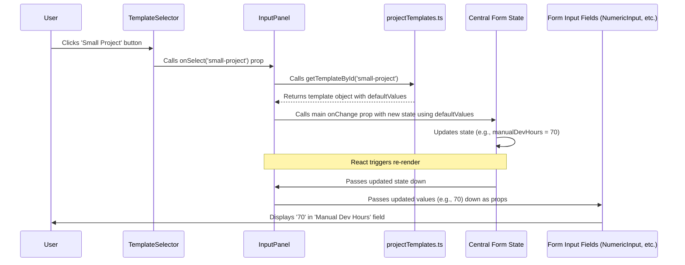
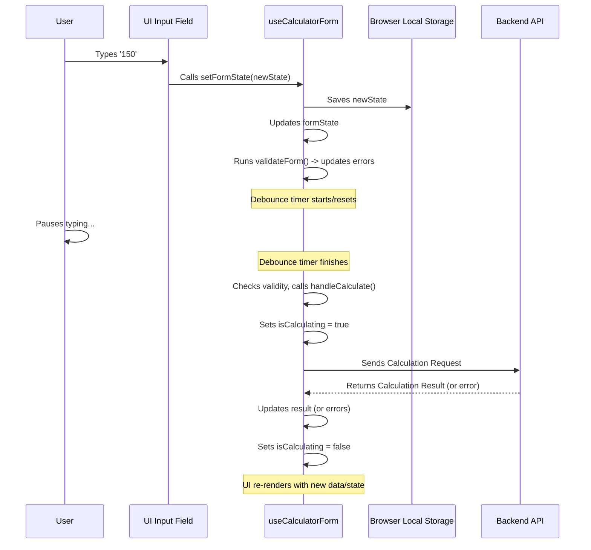
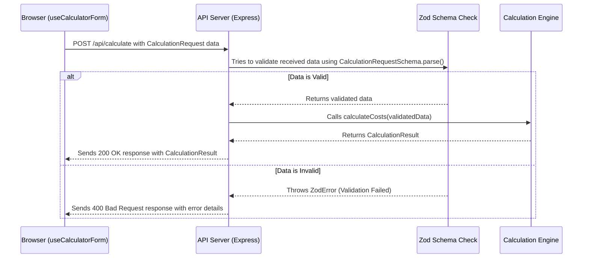
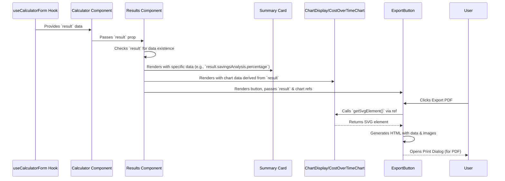

# Agentic Cost Calculator

This project is a web application designed to help users *estimate* and *compare* the costs and timelines of software development projects.

It contrasts the **traditional** development approach with a modern **agentic** approach (using AI assistance).
Users input project details, choose AI models, and the application calculates potential costs, time savings, and other metrics, presenting them in an easy-to-understand format with charts and summaries.

- [Agentic Cost Calculator](#agentic-cost-calculator)
  - [Architecture Overview](#architecture-overview)
  - [Calculation Engine](#calculation-engine)
    - [How the Engine Works: Inputs and Outputs](#how-the-engine-works-inputs-and-outputs)
    - [Under the Hood: The Calculation Process](#under-the-hood-the-calculation-process)
    - [Peeking at the Code (Simplified)](#peeking-at-the-code-simplified)
    - [Conclusion](#conclusion)
  - [Core Data Structures](#core-data-structures)
    - [The "Nouns" of the System](#the-nouns-of-the-system)
    - [Example Blueprints (Simplified Code)](#example-blueprints-simplified-code)
    - [How Data Flows Using These Structures](#how-data-flows-using-these-structures)
    - [Where Are These Defined?](#where-are-these-defined)
    - [Conclusion](#conclusion-1)
  - [UI Input System](#ui-input-system)
    - [What is the UI Input System?](#what-is-the-ui-input-system)
    - [Key Components of the Control Panel](#key-components-of-the-control-panel)
    - [How You Use the Input System](#how-you-use-the-input-system)
    - [Under the Hood: How Inputs Flow](#under-the-hood-how-inputs-flow)
    - [Peeking at the Code (Simplified)](#peeking-at-the-code-simplified-1)
    - [Conclusion](#conclusion-2)
  - [Project Templates](#project-templates)
    - [What are Project Templates?](#what-are-project-templates)
    - [How Templates are Defined: The Recipe Book](#how-templates-are-defined-the-recipe-book)
    - [How Templates are Used: Choosing a Recipe](#how-templates-are-used-choosing-a-recipe)
    - [Under the Hood: Applying the Recipe](#under-the-hood-applying-the-recipe)
    - [Conclusion](#conclusion-3)
  - [Client Form Management](#client-form-management)
    - [The Brain Behind the Form: `useCalculatorForm`](#the-brain-behind-the-form-usecalculatorform)
    - [How the Calculator Uses the Assistant](#how-the-calculator-uses-the-assistant)
    - [Under the Hood: A Day in the Life of the Form Assistant](#under-the-hood-a-day-in-the-life-of-the-form-assistant)
    - [Peeking at the Code (Simplified)](#peeking-at-the-code-simplified-2)
    - [Conclusion](#conclusion-4)
  - [API Layer \& Validation](#api-layer--validation)
    - [The Server's Receptionist: The API Layer](#the-servers-receptionist-the-api-layer)
    - [Why Do We Need a Server and API?](#why-do-we-need-a-server-and-api)
    - [The `/api/calculate` Endpoint](#the-apicalculate-endpoint)
    - [Validation: The Strict Gatekeeper](#validation-the-strict-gatekeeper)
    - [Under the Hood: How the Server Handles a Request](#under-the-hood-how-the-server-handles-a-request)
    - [Conclusion](#conclusion-5)
  - [UI Results Display](#ui-results-display)
    - [The Dashboard: What It Does](#the-dashboard-what-it-does)
    - [Key Components of the Dashboard](#key-components-of-the-dashboard)
    - [How the Dashboard Gets Its Data](#how-the-dashboard-gets-its-data)
    - [Under the Hood: Building the Display](#under-the-hood-building-the-display)
    - [Visualising the Flow](#visualising-the-flow)
  - [Conclusion](#conclusion-6)

## Architecture Overview



---

## Calculation Engine

Think of the Calculation Engine as a highly specialised calculator. Its main job is performed by a function called `calculateCosts`. This function is like the "Total" button on our calculator. You feed it various pieces of information:

1. **Project Details:** How many hours would this project normally take? What's the average developer salary? (We'll explore these in Core Data Structures).
2. **Model Choice:** Which AI model(s) are you planning to use? (This comes from the `LLMConfig`).
3. **Usage Estimates:** How much do you expect to use the AI? How many developers are involved?
4. **Global Settings:** What's the current currency exchange rate?

The `calculateCosts` function takes all these inputs and uses specific formulas to figure out:

- **Traditional Cost & Time:** How much would this project likely cost and how long would it take using standard, non-AI methods?
- **Agentic Cost & Time:** How much would it cost (including AI fees and human effort) and how long would it take if you use AI assistance (the "agentic" approach)?
- **Savings:** How much money and time could you potentially save by using the agentic approach compared to the traditional one?
- **Ongoing Costs:** If applicable, what are the estimated daily costs for continued AI usage?

It handles all the complex financial math and time estimations based on the parameters you provide.

### How the Engine Works: Inputs and Outputs

The Calculation Engine isn't something you interact with directly like clicking buttons in an app. It's a function within the code that gets called when needed.

Let's imagine we want to calculate the costs. We first gather all the necessary information into a package deal called `CalculationRequest`. This request contains everything the engine needs.

```typescript
// Simplified Input Structure (more details in 3)
interface CalculationRequest {
  globalParams: { // Settings like currency rate, project name
    currencyRate: number;
    // ... other global settings
  };
  modelConfig: { // Which AI model(s) to use
    primaryModelId: string;
    // ... optional secondary model info
  };
  projectParams?: { // Details about a specific project
    manualDevHours: number; // Estimated hours for traditional way
    averageHourlyRate: number; // Cost per hour (e.g., in AUD)
    totalProjectTokens: number; // Estimated AI usage for the project
    agenticMultiplier: number; // How much faster AI makes things (e.g., 3x)
    // ... other project details
  };
  teamParams?: { // Details about ongoing team usage
    numberOfDevs: number;
    tokensPerDevPerDay: number;
    // ... other team details
  };
  // ... other parameters like product-specific usage
}
```

This `CalculationRequest` object packages up all the details gathered, perhaps from a user filling out a form (which we'll cover in the UI Input System).

This request is then passed to the main engine function: `calculateCosts`.

```typescript
// File: src/shared/utils/calculations.ts (Simplified Call)

import { calculateCosts } from './calculations';
import { CalculationRequest, CalculationResult } from '../types/models';

// Assume 'myRequest' is a CalculationRequest object filled with data
const myRequest: CalculationRequest = { /* ... filled with inputs ... */ };

// Call the engine!
const results: CalculationResult = calculateCosts(myRequest);

// Now 'results' holds all the calculated costs, times, savings etc.
console.log(results.traditionalCost);
console.log(results.agenticCost);
console.log(results.savingsAnalysis);
```

After the `calculateCosts` function does its magic, it returns another package deal called `CalculationResult`. This contains all the answers we were looking for.

```typescript
// Simplified Output Structure (more details in 3)
interface CalculationResult {
  traditionalCost?: { usd: number; aud: number };
  traditionalTime?: number; // in hours
  agenticCost?: {
    total: { usd: number; aud: number };
    inference: { usd: number; aud: number }; // Cost of AI tokens
    human: { usd: number; aud: number };     // Cost of human time (agentic)
  };
  agenticTime?: number; // in hours
  savingsAnalysis?: {
    cost: { usd: number; aud: number };
    percentage: number;
    timeInHours: number;
  };
  dailyCosts?: { // If ongoing usage calculated
    total: { usd: number; aud: number };
  };
  // ... other results like token usage breakdown, descriptions
}
```

So, the core interaction is simple: package up the inputs (`CalculationRequest`), call the engine (`calculateCosts`), and receive the outputs (`CalculationResult`).

### Under the Hood: The Calculation Process

How does `calculateCosts` actually figure everything out? It doesn't do it all in one giant step. Instead, it acts like a manager, calling specialised helper functions for different parts of the calculation.

Here's a step-by-step overview of what happens inside `calculateCosts`:

1. **Receive Request:** The function gets the `CalculationRequest` object containing all the inputs.
2. **Get Model Details:** It uses the `modelId`(s) from the request to look up the specific `ModelProfile`(s) (cost per token, speed multiplier, etc.) from the `modelConfig` catalog we saw in [1](01_llm_profiles_.md).
3. **Calculate Traditional Costs:** If project details are provided, it calls a helper function (like `calculateTraditionalCostsInternal`) to figure out the cost and time for the non-AI approach (e.g., `manual hours * hourly rate`).
4. **Calculate Agentic Costs:** If project details are provided, it calls another helper (like `calculateAgenticCostsInternal`). This helper does two main things:
    - Calculates the **AI inference cost** by calling *another* helper (`calculateTokenCostUsd`) which uses the `ModelProfile` costs and estimated token usage.
    - Calculates the **human effort cost** for the agentic approach (e.g., `(manual hours / speed multiplier) * hourly rate`).
5. **Calculate Daily Costs:** If details about ongoing team or product usage are provided, it calls a helper (like `calculateDailyCostsInternal`) to estimate the daily AI token costs.
6. **Calculate Savings:** If both traditional and agentic project costs were calculated, it compares them to find the cost and time savings.
7. **Package Results:** It gathers all the calculated numbers (costs in USD and AUD, times, savings percentages, token counts) and puts them into the `CalculationResult` object.
8. **Return Results:** The function returns the completed `CalculationResult`.

Let's visualise this flow:



### Peeking at the Code (Simplified)

Let's look at tiny snippets to see how these steps translate to code.

**1. The Main Engine Function (`calculateCosts`)**

This function orchestrates the process, calling helpers.

```typescript
// File: src/shared/utils/calculations.ts (Simplified)

import { CalculationRequest, CalculationResult } from '../types/models';
import { getModelProfile } from './modelConfig'; // From 1
import { calculateTraditionalCostsInternal, calculateAgenticCostsInternal, calculateDailyCostsInternal } from './calculations'; // Helper functions

export const calculateCosts = (req: CalculationRequest): CalculationResult => {
    const result: Partial<CalculationResult> = {}; // Start with an empty result
    const { globalParams, modelConfig, projectParams, teamParams } = req;

    // Get currency rate (important!)
    const rate = globalParams.currencyRate;

    // --- Traditional Calculation ---
    if (projectParams) {
        const { cost, time } = calculateTraditionalCostsInternal(projectParams, globalParams);
        result.traditionalCost = cost;
        result.traditionalTime = time;
    }

    // --- Agentic Calculation ---
    if (projectParams) {
        const { breakdown, time } = calculateAgenticCostsInternal(projectParams, modelConfig, globalParams);
        result.agenticCost = breakdown;
        result.agenticTime = time;
        // ... calculate human guidance, setup costs etc. ...
    }

    // --- Daily Cost Calculation ---
    if (teamParams /* or productParams */) {
        const { dailyTotalUsd } = calculateDailyCostsInternal(teamParams, /*...*/);
        // ... convert to AUD and store in result.dailyCosts ...
    }

    // --- Savings Analysis ---
    if (result.traditionalCost && result.agenticCost) {
        // ... calculate savings based on the above costs ...
        // result.savingsAnalysis = { ... };
    }

    // ... prepare other parts of the result ...

    return result as CalculationResult; // Return the complete result
};
```

This shows how `calculateCosts` acts as the central coordinator.

**2. Calculating Traditional Cost (Helper)**

This is usually simpler math based on human effort.

```typescript
// File: src/shared/utils/calculations.ts (Simplified Helper)

const calculateTraditionalCostsInternal = (
    projectParams: ProjectParameters,
    globalParams: GlobalParameters
): { cost: CurrencyPair; time: number } => {
    const manualHours = projectParams.manualDevHours || 0;
    const hourlyRateAud = projectParams.averageHourlyRate || 0;
    const rate = globalParams.currencyRate || 1;

    // Basic cost = hours * rate
    const totalAud = manualHours * hourlyRateAud;
    const totalUsd = convertAudToUsd(totalAud, rate); // Convert currency

    return {
        cost: { usd: totalUsd, aud: totalAud },
        time: manualHours
    };
};
```

**3. Calculating Agentic Cost (Helper)**

This is more complex, involving both AI and human costs.

```typescript
// File: src/shared/utils/calculations.ts (Simplified Helper)

const calculateAgenticCostsInternal = (
    projectParams: ProjectParameters,
    llmConfig: LLMConfig,
    globalParams: GlobalParameters
): { breakdown: AgenticBreakdown; time: number; /*...*/ } => {

    // 1. Calculate Inference Cost (Uses another helper!)
    const { usd: inferenceCostUsd, usage } = calculateTokenCostUsd(
        projectParams.totalProjectTokens || 0,
        // ... other params like token ratios ...
        llmConfig, globalParams
    );

    // 2. Calculate Agentic Human Time & Cost
    const manualHours = projectParams.manualDevHours || 0;
    const agenticMultiplier = projectParams.agenticMultiplier || 3; // e.g., 3x faster
    // Adjust multiplier based on model speed (from ModelProfile)
    // const effectiveMultiplier = ...
    const agenticHours = manualHours / agenticMultiplier; // Simplified calculation

    const hourlyRateAud = projectParams.averageHourlyRate || 0;
    const hourlyRateUsd = convertAudToUsd(hourlyRateAud, globalParams.currencyRate);
    const humanCostUsd = hourlyRateUsd * agenticHours;

    // 3. Combine and Convert Currency
    const totalAgenticCostUsd = inferenceCostUsd + humanCostUsd;
    const totalAgenticCostAud = convertUsdToAud(totalAgenticCostUsd, globalParams.currencyRate);
    // ... also convert inference/human costs to AUD ...

    return {
        breakdown: {
            inference: { usd: inferenceCostUsd, /* aud */ },
            human: { usd: humanCostUsd, /* aud */ },
            total: { usd: totalAgenticCostUsd, aud: totalAgenticCostAud }
        },
        time: agenticHours,
        // tokenUsage: usage
    };
};
```

**4. Calculating Token Cost (Deepest Helper)**

This is where the `ModelProfile` from [1](01_llm_profiles_.md) comes into play directly.

```typescript
// File: src/shared/utils/calculations.ts (Simplified Helper)

const calculateTokenCostUsd = (
    baseInputTokens: number,
    // ... other params like input/output ratio, cache ratio ...
    llmConfig: LLMConfig,
    globalParams: GlobalParameters
): { usd: number; usage: TokenUsage } => {
    // Get the specific model's price list
    const primaryModel = getModelProfile(llmConfig.primaryModelId);
    // ... handle secondary model if used ...

    // Calculate how many input vs output tokens (simplified)
    const effectiveInputTokens = baseInputTokens * 0.5; // Assume 50% input
    const effectiveOutputTokens = baseInputTokens * 0.5; // Assume 50% output

    // Calculate cost using the profile's prices (per 1 Million tokens)
    const inputCost = (effectiveInputTokens * primaryModel.inputTokenCost1M) / 1_000_000;
    const outputCost = (effectiveOutputTokens * primaryModel.outputTokenCost1M) / 1_000_000;
    // ... add cache costs if applicable ...

    const totalCostUsd = inputCost + outputCost;

    return {
        usd: totalCostUsd,
        usage: { /* ... token counts ... */ }
    };
};
```

This shows how the costs from the `ModelProfile` are multiplied by the estimated token counts to get the actual AI inference cost.

### Conclusion

You've now seen the heart of `agentic_cost_calc`: the **Calculation Engine**.

- It acts as a specialised calculator, primarily through the `calculateCosts` function.
- It takes various inputs like project details, AI model choices ([LLM Profiles](01_llm_profiles_.md)), and usage estimates.
- It uses helper functions to perform specific calculations: traditional costs, agentic costs (AI + human), daily costs, and savings.
- The engine relies heavily on the `ModelProfile` data (costs, speed) to accurately estimate the agentic approach.
- It outputs a comprehensive `CalculationResult` containing all the key financial and time estimates.!

---

## Core Data Structures

We explored the Calculation Engine, the "brain" that crunches all the numbers for our cost estimates. We saw that it takes an input package (`CalculationRequest`) and produces an output package (`CalculationResult`).

But what exactly *are* these packages? How does the calculator know what information to expect, and how does it guarantee the results are presented in a consistent way?

Imagine you're ordering food online. You fill out a form with specific fields: your name, address, what items you want, quantity, special instructions. The restaurant needs this information in a predictable format to process your order. When they send you a confirmation or receipt, it also has a standard layout: order number, itemised list, total cost, estimated delivery time.

**Core Data Structures** in `agentic_cost_calc` are just like these standardised forms and receipts. They define the exact "shape" or "blueprint" for different pieces of information used throughout the application. They act as a common language, ensuring that everyone (the user interface, the calculation engine, the API) understands the data being passed around.

### The "Nouns" of the System

These data structures define the key "things" or "nouns" that our application works with. Let's meet the most important ones:

1. **`CalculationRequest`**: The Order Form
    - This structure holds all the information the user provides to *start* a calculation. It's like the order form you fill out online. It contains details about the project, the AI models chosen, team size, currency rates, etc.
2. **`CalculationResult`**: The Receipt / Bill
    - This structure holds all the answers *after* the [Calculation Engine](02_calculation_engine_.md) has done its work. It's like the final receipt or bill you receive. It includes the calculated traditional costs, agentic costs, savings, time estimates, and more.
3. **`ModelProfile`**: The Menu Item Details
    - We met this in [1: LLM Profiles](01_llm_profiles_.md)! It defines the blueprint for storing the costs and performance details of a specific AI model. Think of it as the detailed description and price of a single item on the restaurant menu.
4. **Supporting Structures**: Sections on the Form
    - Within the main `CalculationRequest`, we have smaller structures to organise related information, like:
        - `ProjectParameters`: Details about a specific project (e.g., hours, token estimates).
        - `TeamParameters`: Details about ongoing team usage (e.g., number of developers).
        - `GlobalParameters`: Settings that apply everywhere (e.g., currency exchange rate).
        - `LLMConfig`: Which AI model(s) to use (references `ModelProfile` IDs).
        - `CurrencyPair`: A simple structure to hold a value in both USD and AUD.

These blueprints ensure that data is consistent. When the user interface ([UI Input System](04_ui_input_system_.md)) collects information, it packages it into a `CalculationRequest`. The [Calculation Engine](02_calculation_engine_.md) knows exactly where to find the `manualDevHours` or the `primaryModelId` within that request because the structure is predefined. Similarly, when the engine produces results, it puts them into a `CalculationResult`, and the part of the app that shows the results ([UI Results Display](08_ui_results_display_.md)) knows exactly where to look for the `total` agentic cost.

### Example Blueprints (Simplified Code)

Let's look at simplified versions of these blueprints, written using TypeScript interfaces. These define the expected shape of the data.

**1. `CalculationRequest` (The Order Form)**

This is what we send *to* the [Calculation Engine](02_calculation_engine_.md).

```typescript
// File: src/shared/types/models.ts (Simplified View)

interface CalculationRequest {
  // Which AI models? (References ModelProfile IDs)
  modelConfig: {
    primaryModelId: string;
    secondaryModelId?: string;
    modelRatio?: number; // 0-1, how much primary model used
  };

  // Overall settings
  globalParams: {
    currencyRate: number; // e.g., 1.5 (1 USD = 1.5 AUD)
    // ... other global settings ...
  };

  // Details for a one-off project cost estimate
  projectParams?: {
    manualDevHours: number; // How long without AI?
    averageHourlyRate: number; // Developer cost (AUD)
    totalProjectTokens: number; // Estimated AI usage
    agenticMultiplier: number; // How much faster with AI?
    // ... other project details ...
  };

  // Details for ongoing team usage cost estimate
  teamParams?: {
    numberOfDevs: number;
    tokensPerDevPerDay: number; // AI usage per dev
    // ... other team details ...
  };

  // ... maybe product parameters too ...
}
```

This interface clearly defines that a `CalculationRequest` needs `modelConfig` and `globalParams`, and can optionally include `projectParams` and `teamParams`.

**2. `CalculationResult` (The Receipt)**

This is what we get *back* from the [Calculation Engine](02_calculation_engine_.md).

```typescript
// File: src/shared/types/models.ts (Simplified View)

// Helper for costs in two currencies
interface CurrencyPair {
  usd: number;
  aud: number;
}

// Helper for agentic cost breakdown
interface AgenticBreakdown {
  inference: CurrencyPair; // Cost of AI use
  human: CurrencyPair;     // Cost of human time (agentic)
  total: CurrencyPair;     // Total agentic cost
}

interface CalculationResult {
  // Costs/Time for the traditional (non-AI) way
  traditionalCost?: CurrencyPair;
  traditionalTime?: number; // in hours

  // Costs/Time for the agentic (AI-assisted) way
  agenticCost?: AgenticBreakdown;
  agenticTime?: number; // in hours

  // How much you save
  savingsAnalysis?: {
    cost: CurrencyPair;
    percentage: number;
    timeInHours: number;
  };

  // Ongoing daily costs (if calculated)
  dailyCosts?: {
    total: CurrencyPair;
  };

  // ... other results like token breakdown, descriptions ...
}
```

This interface tells us exactly what fields to expect in the result, such as the `traditionalCost` (which is a `CurrencyPair`) or the `agenticCost` (which is broken down further).

### How Data Flows Using These Structures

These structures act like standardised containers ensuring data moves smoothly between different parts of the system.



The key idea is that the *shape* of the data (`CalculationRequest` and `CalculationResult` blueprints) is agreed upon beforehand. This prevents errors and makes it easy for different parts of the code to communicate reliably.

### Where Are These Defined?

All these core data structures (the blueprints) are defined centrally in one place to ensure consistency.

**File:** `src/shared/types/models.ts`

This file contains all the TypeScript `interface` definitions for `CalculationRequest`, `CalculationResult`, `ModelProfile`, `ProjectParameters`, `TeamParameters`, `GlobalParameters`, `LLMConfig`, `CurrencyPair`, and other related structures.

Having them in a shared location (`src/shared/`) means that both the frontend code (like the user interface) and the backend or calculation logic can import and use the exact same definitions, guaranteeing they speak the same language.

Let's look at a slightly more detailed (but still simplified) view from that file:

```typescript
// File: src/shared/types/models.ts (More Detail)

/** Represents a monetary value in both USD and AUD. */
export interface CurrencyPair {
  usd: number;
  aud: number;
}

/** Configuration for the LLM(s) to be used. */
export interface LLMConfig {
  primaryModelId: string; // Link to ModelConfig
  secondaryModelId?: string;
  modelRatio?: number; // 0-1
}

/** Parameters specific to the project's scope. */
export interface ProjectParameters {
  manualDevHours: number;
  agenticMultiplier: number; // e.g., 3x faster
  humanGuidanceTime: number;
  averageHourlyRate: number; // AUD
  outputTokenPercentage: number; // e.g., 20
  cachedTokenPercentage: number; // e.g., 80
  totalProjectTokens: number;
  // ... other optional project fields ...
}

/** Global parameters affecting the calculation. */
export interface GlobalParameters {
  currencyRate: number; // AUD per 1 USD
  // ... other optional global fields ...
}

/** The overall request for a cost calculation. */
export interface CalculationRequest {
  projectType: 'oneoff' | 'ongoing' | 'both';
  globalParams: GlobalParameters;
  modelConfig: LLMConfig;
  projectParams?: ProjectParameters;
  teamParams?: TeamParameters; // (Structure not shown here)
  productParams?: ProductParameters; // (Structure not shown here)
}

// --- RESULT STRUCTURES ---

/** Breakdown of costs specifically for the agentic approach. */
export interface AgenticBreakdown {
  inference: CurrencyPair;
  human: CurrencyPair;
  total: CurrencyPair;
}

/** Analysis of savings. */
export interface SavingsData {
  cost: CurrencyPair;
  percentage: number;
  timeInHours: number;
  roi: number;
}

/** Represents the complete result of a cost calculation. */
export interface CalculationResult {
  traditionalCost?: CurrencyPair;
  traditionalTime?: number;
  agenticTime?: number;
  agenticCost?: AgenticBreakdown;
  savingsAnalysis?: SavingsData;
  dailyCosts?: { /* ... */ }; // Simplified
  tokenUsage?: { /* ... */ }; // Simplified
  // ... many other optional result fields ...
}
```

Even with more detail, the principle remains the same: these interfaces define the expected properties and their types (like `number` or `string` or another `interface`), ensuring data consistency.

### Conclusion

You've now learned about the Core Data Structures in `agentic_cost_calc`. These are the essential blueprints that define the shape of information as it moves through the application.

- They act like **standardised forms (`CalculationRequest`) and receipts (`CalculationResult`)**.
- Key structures include `CalculationRequest`, `CalculationResult`, `ModelProfile`, and supporting structures like `ProjectParameters`.
- They ensure **consistency** and act as a **common language** between different parts of the system (UI, Engine, API).
- They are centrally defined in `src/shared/types/models.ts`.

---

## UI Input System

We learned about the Core Data Structures like `CalculationRequest` – the "order form" that holds all the details needed to perform a cost estimation. Great, we know *what* information we need!

But how does the user actually *give* us that information? If you want to estimate the cost of using AI for your project, you need to tell the calculator things like: How long would the project normally take? Which AI model do you want to use? How many developers are on your team?

This is where the **UI Input System** comes in. Think of it as the application's **control panel**. It's everything you see and interact with on the screen to enter data: the buttons, dropdowns, sliders, and text boxes.

### What is the UI Input System?

The UI Input System is the collection of all interactive form elements that allow you to input the necessary data for the `agentic_cost_calc`. It's the bridge between you (the user) and the application's [Calculation Engine](02_calculation_engine_.md).

Imagine the dashboard of a car. You have a steering wheel, pedals, buttons for the radio, knobs for the air conditioning. Each control lets you provide input to the car. Our UI Input System is similar – it's a dashboard full of specialised controls for providing project details.

### Key Components of the Control Panel

Our control panel isn't just one big blob; it's organised into logical parts, built from reusable components:

1. **`InputPanel` (The Main Dashboard):** This is the master component that brings everything together. It holds and organizes all the different input sections and fields you see on the main form page. It decides which specific forms (like Project details or Team details) to show based on your selections.
    - *File:* `src/client/components/inputs/InputPanel.tsx`
2. **`FormSection` (Sections on the Dashboard):** To keep things organised, inputs are grouped into sections. `FormSection` provides a consistent look with a title and description for a group of related fields (e.g., "Project Parameters", "Global Settings").
    - *File:* `src/client/components/inputs/FormSection.tsx`
3. **Specific Controls (Knobs, Buttons, Sliders):**
    - **Selectors (`ProjectTypeSelector`, `ModelSelector`):** These let you choose from a list of options. For example, selecting whether your project is a one-off task or ongoing work, or choosing which AI model (like Claude or GPT) you plan to use.
        - *Files:* `src/client/components/inputs/ProjectTypeSelector.tsx`, `src/client/components/inputs/ModelSelector.tsx`
    - **Numeric Inputs (`NumericInput`):** Specialised text boxes designed for entering numbers, like developer hours, costs, or the number of AI tokens. They often have features like minimum/maximum values or step increments.
        - *File:* `src/client/components/inputs/NumericInput.tsx`
    - **Text Inputs/Areas (`ProjectDetailsForm`):** Standard fields for entering text like the project name or description.
        - *File:* `src/client/components/inputs/ProjectDetailsForm.tsx` (Uses standard HTML inputs)
    - **Template Buttons (`TemplateSelector`):** Quick-start buttons that fill the form with pre-defined values for common scenarios (we'll cover this more in Project Templates).
        - *File:* `src/client/components/inputs/TemplateSelector.tsx`
4. **Grouped Forms (`ProjectParametersForm`, `TeamParametersForm`, etc.):** These components use `FormSection` and specific controls (`NumericInput`, etc.) to create dedicated forms for collecting data related to the structures we saw in core_data_structures (like `ProjectParameters`, `TeamParameters`).
    - *Files:* `src/client/components/inputs/ProjectParametersForm.tsx`, `src/client/components/inputs/TeamParametersForm.tsx`, `src/client/components/inputs/GlobalParametersForm.tsx`, etc.

### How You Use the Input System

Using the input system is straightforward:

1. **Interact:** You click buttons (like in `ProjectTypeSelector`), select options from dropdowns (`ModelSelector`), type numbers into fields (`NumericInput`), or enter text (`ProjectDetailsForm`).
2. **State Updates:** Each interaction updates the application's internal memory (its "state"). This state holds the current values for all the inputs, gradually building up the information needed for the `CalculationRequest`.
3. **See Changes:** The input fields immediately reflect the values you entered or selected.

For example, when you select 'One-off Project' using the `ProjectTypeSelector`, the `InputPanel` notices this change and might then display the `ProjectParametersForm` while hiding the `TeamParametersForm`. If you then type `100` into the "Manual Development Hours" `NumericInput` within the `ProjectParametersForm`, the application remembers that value.

### Under the Hood: How Inputs Flow

The user interface is built using a library called React. In React, UIs are built from components that manage their own data (state) and pass data down to child components (props).

Here's a simplified step-by-step of what happens when you change a value:

1. **User Action:** You type "100" into the "Manual Dev Hours" `NumericInput`.
2. **Component Event:** The `NumericInput` component detects this change (an `onChange` event).
3. **Notify Parent:** The `NumericInput` doesn't store the value itself permanently. Instead, it calls a function (also typically named `onChange`) that was passed down to it as a property (a "prop") by its parent component (e.g., `ProjectParametersForm`). It tells the parent, "Hey, the value is now 100."
4. **Bubble Up:** The `ProjectParametersForm` receives this notification. It updates its understanding of the project parameters and then calls *its* `onChange` function, passed down from *its* parent (the `InputPanel`). It tells the `InputPanel`, "Hey, the project parameters have changed, here's the new 'manualDevHours' value."
5. **Central Update:** The `InputPanel` (or a component managing the overall form state) receives the notification. It updates the main collection of all form data (let's call it `CalculationFormState`).
6. **Re-render:** Because the central state has changed, React tells the components to refresh themselves. The `InputPanel` passes the updated `manualDevHours` value back down through `ProjectParametersForm` to the `NumericInput`.
7. **Display Update:** The `NumericInput` receives the new value (100) as a prop and displays it in the text box.

This might sound complicated, but it's a standard pattern in React called "lifting state up". It ensures there's a single source of truth for the form data.

Let's visualise this flow:



### Peeking at the Code (Simplified)

Let's look at simplified code snippets to see how these components connect.

**1. `NumericInput` (The Basic Control)**

This component displays a number input and calls its `onChange` prop when the user types.

```typescript
// File: src/client/components/inputs/NumericInput.tsx (Simplified)
import React from 'react';

interface NumericInputProps {
  value: number | undefined; // The current value to display
  onChange: (value: number | undefined) => void; // Function to call when value changes
  label?: string;
  // ... other props like min, max, step, etc.
}

export const NumericInput: React.FC<NumericInputProps> = ({
  value,
  onChange,
  label,
  // ... other props
}) => {
  const handleChange = (e: React.ChangeEvent<HTMLInputElement>) => {
    const rawValue = e.target.value;
    const num = rawValue === '' ? undefined : parseInt(rawValue, 10);

    if (rawValue !== '' && isNaN(num)) {
      return; // Ignore non-numeric input
    }
    // Call the function passed by the parent component
    onChange(num);
  };

  return (
    <div>
      {label && <label>{label}</label>}
      <input
        type="number"
        value={value === undefined ? '' : value}
        onChange={handleChange}
        // ... other input attributes
      />
    </div>
  );
};
```

- It receives the current `value` and the `onChange` function via props.
- When the user types, `handleChange` is called.
- It converts the input text to a number (`num`).
- Crucially, it calls the `onChange` prop passed from its parent, sending the new number back up.

**2. `ProjectParametersForm` (Grouping Controls)**

This component groups several `NumericInput`s (and potentially other controls) related to project parameters. It manages the `ProjectParameters` part of the state.

```typescript
// File: src/client/components/inputs/ProjectParametersForm.tsx (Simplified)
import React from 'react';
import { ProjectParameters } from '@/shared/types/models'; // From 3
import { FormSection } from './FormSection';
import { NumericInput } from './NumericInput';

interface ProjectParametersFormProps {
  value: Partial<ProjectParameters>; // The current project parameters
  onChange: (params: Partial<ProjectParameters>) => void; // Function to call when any param changes
}

export const ProjectParametersForm: React.FC<ProjectParametersFormProps> = ({
  value,
  onChange,
}) => {
  // This function handles changes from ANY NumericInput inside this form
  const handleChange = <K extends keyof ProjectParameters>(
    key: K,
    val: ProjectParameters[K] | undefined
  ) => {
    // Update the specific parameter (e.g., 'manualDevHours')
    const updatedParams = {
      ...value,
      [key]: val
    };
    // Notify the parent (InputPanel) about the change
    onChange(updatedParams);
  };

  return (
    <FormSection title="Project Parameters">
      <NumericInput
        label="Manual Development Hours"
        value={value.manualDevHours}
        // Pass a specific handler for *this* input
        onChange={(v) => handleChange('manualDevHours', v)}
      />
      <NumericInput
        label="Average Hourly Rate"
        value={value.averageHourlyRate}
        onChange={(v) => handleChange('averageHourlyRate', v)}
      />
      {/* ... other NumericInputs for project parameters ... */}
    </FormSection>
  );
};
```

- It receives the current `value` (an object like `{ manualDevHours: 100, averageHourlyRate: 50 }`) and an `onChange` function from `InputPanel`.
- For each `NumericInput`, it passes down the relevant part of the `value` (e.g., `value.manualDevHours`).
- It also passes down a *specific version* of the `handleChange` function to each `NumericInput`. This version knows *which* parameter is being changed (`'manualDevHours'`, `'averageHourlyRate'`, etc.).
- When any child `NumericInput` calls its `onChange`, the `handleChange` function updates the local `updatedParams` object and then calls the main `onChange` prop (from `InputPanel`) with the entire updated `ProjectParameters` object.

**3. `InputPanel` (The Orchestrator)**

This component decides which forms to show and holds the overall form state (or gets it from a parent).

```typescript
// File: src/client/components/inputs/InputPanel.tsx (Simplified)
import React from 'react';
import { CalculationFormState } from '@/shared/types/models'; // Holds all form data
import { ProjectTypeSelector } from './ProjectTypeSelector';
import { ProjectParametersForm } from './ProjectParametersForm';
import { TeamParametersForm } from './TeamParametersForm';
// ... other imports

interface InputPanelProps {
  value: CalculationFormState; // The complete current state of the form
  onChange: (state: CalculationFormState) => void; // Function to update the whole state
}

export const InputPanel: React.FC<InputPanelProps> = ({
  value,
  onChange,
}) => {
  // Decide which forms to show based on project type
  const showProjectSection = value.projectType === 'oneoff' || value.projectType === 'both';
  const showTeamSection = value.projectType === 'ongoing' || value.projectType === 'both';

  return (
    <div className="space-y-8">
      {/* Selector to choose the project type */}
      <ProjectTypeSelector
        value={value.projectType}
        onChange={(type) => onChange({ ...value, projectType: type })}
      />

      {/* Conditionally show Project Parameters form */}
      {showProjectSection && (
        <ProjectParametersForm
          value={value.projectParams || {}}
          onChange={(params) => onChange({ ...value, projectParams: params })}
        />
      )}

      {/* Conditionally show Team Parameters form */}
      {showTeamSection && (
        <TeamParametersForm
          value={value.teamParams || {}}
          onChange={(params) => onChange({ ...value, teamParams: params })}
        />
      )}

      {/* ... Other forms like GlobalParametersForm, ModelSelector etc. ... */}
    </div>
  );
};
```

- It receives the entire `value` (the `CalculationFormState`) and the main `onChange` function to update that state.
- It renders components like `ProjectTypeSelector`, passing the relevant part of the state (`value.projectType`) and a function that updates just that part (`onChange({ ...value, projectType: type })`).
- It conditionally renders `ProjectParametersForm` or `TeamParametersForm` based on `value.projectType`.
- It passes the relevant slice of the state (`value.projectParams`) and an appropriate `onChange` handler down to each specific form.

This structure allows each component to focus on its specific job while ensuring all data flows correctly back to a central state.

### Conclusion

You've now explored the **UI Input System**, the crucial part of `agentic_cost_calc` that lets you provide the data needed for calculations.

- It's the **control panel** of the application, composed of interactive elements.
- Key components include the main orchestrator (`InputPanel`), organisational blocks (`FormSection`), specific controls (`NumericInput`, `ModelSelector`), and grouped forms (`ProjectParametersForm`).
- These components work together using React's state and props system to gather user input and build the data structure (like `CalculationRequest` from [3](03_core_data_structures_.md)) needed by the [Calculation Engine](02_calculation_engine_.md).

Filling out forms can sometimes be repetitive, especially for common project types. Wouldn't it be nice if we could just click a button to pre-fill the form with typical values for, say, a "Medium Web App Migration" project? That's exactly what the next is about!

## Project Templates

In the [previous chapter](04_ui_input_system_.md), we learned about the [UI Input System](04_ui_input_system_.md) – the control panel with all the buttons, sliders, and boxes you use to enter project details into the `agentic_cost_calc`. We saw how components like `NumericInput` and `ProjectParametersForm` help gather the information needed for a `CalculationRequest`.

But imagine you're estimating costs for a pretty standard "Medium-Sized Web Project". Do you really need to fill out every single field from scratch every time? That sounds tedious! You might not even know typical values for things like "Agentic Multiplier" or "Total Project Tokens" for such a project.

Wouldn't it be nice if there were some pre-filled examples you could start with?

This is exactly what **Project Templates** provide!

### What are Project Templates?

Think of Project Templates like **cooking recipes** or **presets** in a software application.

- A **cooking recipe** gives you a list of starting ingredients and quantities for a specific dish (like chocolate chip cookies). You can follow it exactly, or you can adjust it (maybe add more chocolate chips!).
- A **preset** in a photo editor might give you a starting point for a "vintage" look, applying several settings at once. You can use it as-is or tweak it further.

Similarly, Project Templates in `agentic_cost_calc` are **pre-filled configurations** for common project scenarios, like:

- A very small task ("Micro Project")
- A typical small feature development ("Small Project")
- A larger system build ("Large Project")
- Estimating only ongoing costs ("Ongoing Usage Only")

When you select a template, it quickly populates many of the input fields in the UI Input System with sensible default values for that scenario. This gives you a convenient starting point and also shows you examples of typical settings.

### How Templates are Defined: The Recipe Book

Where do these recipes come from? They are defined directly in the code, like entries in a recipe book. Each template has:

- An **ID**: A unique identifier (like `small-project`).
- A **Name**: A user-friendly name (like "Small Project").
- A **Description**: Explaining the scenario it represents.
- **`defaultValues`**: The most important part! This is an object containing the pre-filled values for the various input fields. It looks a lot like the `CalculationFormState` we mentioned in the UI Input System, which itself is built from structures like `ProjectParameters` defined in Core Data Structures.

Let's look at a simplified example of how a template might be defined in the code:

```typescript
// File: src/shared/utils/projectTemplates.ts (Simplified Snippet)

// Define a list of available templates
export const templates = [
  {
    id: 'small-project',
    name: 'Small Project',
    description: 'Small project or feature (~9 days manual development)',
    defaultValues: {
      // Tells InputPanel to show the 'oneoff' project form
      projectType: 'oneoff',
      // Pre-fills global settings
      globalParams: { currencyRate: 0.64 /* ... */ },
      // Pre-selects an AI model
      modelConfig: { primaryModelId: 'claude_4_0_sonnet' /* ... */ },
      // Pre-fills project-specific numbers
      projectParams: {
        manualDevHours: 70,
        agenticMultiplier: 8.5,
        totalProjectTokens: 40000000,
        averageHourlyRate: 200,
        // ... other project settings ...
      }
    }
  },
  {
    id: 'ongoing-only',
    name: 'Ongoing Usage Only',
    description: 'Continuous AI usage without initial development',
    defaultValues: {
      // Tells InputPanel to show the 'ongoing' usage forms
      projectType: 'ongoing',
      globalParams: { currencyRate: 0.64 /* ... */ },
      modelConfig: { primaryModelId: 'claude_4_0_sonnet' /* ... */ },
      // Pre-fills team settings
      teamParams: {
        numberOfDevs: 2,
        tokensPerDevPerDay: 5000000,
        // ... other team settings ...
      }
      // No projectParams needed for ongoing-only
    }
  }
  // ... more templates defined here ...
];

// Helper function to find a template by its ID
export const getTemplateById = (id: string) => {
  return templates.find(t => t.id === id);
};
```

- This code defines an array called `templates`. Each object in the array is one template (one recipe).
- The `defaultValues` object holds the specific numbers and selections (like `manualDevHours: 70`) that will fill the form when this template is chosen.
- The `getTemplateById` function is a simple helper to retrieve a specific template's definition using its unique `id`.

This `projectTemplates.ts` file acts as our central recipe book.

### How Templates are Used: Choosing a Recipe

Okay, we have the recipes. How does the user actually choose one?

The UI Input System includes a dedicated component, typically shown near the top of the form, that displays these templates as clickable buttons or cards. This component is called `TemplateSelector`.

```typescript
// File: src/client/components/inputs/TemplateSelector.tsx (Simplified)
import React from 'react';
import { FormSection } from './FormSection';
// Import the recipes from our recipe book
import { templates } from '@/shared/utils/projectTemplates';

interface TemplateSelectorProps {
  // A function passed down from the parent (InputPanel)
  // It expects the ID of the selected template.
  onSelect: (templateId: string) => void;
}

export const TemplateSelector: React.FC<TemplateSelectorProps> = ({ onSelect }) => {
  return (
    <FormSection title="Project Templates" description="Start with a pre-configured template">
      <div /* Styling for layout */>
        {/* Loop through each template (recipe) */}
        {templates.map((template) => (
          <button
            key={template.id} // Unique key for React
            // When clicked, call the onSelect function with the template's ID
            onClick={() => onSelect(template.id)}
            /* Styling for the button */
          >
            <h3>{template.name}</h3>
            <p>{template.description}</p>
            {/* Maybe show some key values */}
            {/* ... like manualDevHours or token count ... */}
          </button>
        ))}
      </div>
    </FormSection>
  );
};
```

- This component takes an `onSelect` function as a property (prop) from its parent component (usually `InputPanel`).
- It uses the `templates` array (our recipe book) to create a button for each template.
- When you click a template button (e.g., "Small Project"), the `onClick` handler calls the `onSelect` function, passing the ID of the clicked template (`'small-project'`).

### Under the Hood: Applying the Recipe

So, what happens when you click the "Small Project" button and the `onSelect('small-project')` function is called? How do the input fields actually get populated?

This action triggers a sequence of events managed primarily by the `InputPanel` component we saw in the ui_input_system:

1. **Click:** You click the "Small Project" button in the `TemplateSelector`.
2. **Notify Parent:** `TemplateSelector` calls its `onSelect` prop with the ID `'small-project'`.
3. **Receive ID:** The `InputPanel` component (which rendered `TemplateSelector` and provided the `onSelect` function) receives the ID `'small-project'`.
4. **Find Template:** `InputPanel` uses the `getTemplateById('small-project')` helper function (from `projectTemplates.ts`) to look up the full definition and `defaultValues` for the "Small Project" template.
5. **Update State:** `InputPanel` takes the `defaultValues` object from the template. It then calls its *own* main `onChange` function (the one responsible for updating the entire form's state) with a new state object that merges these default values into the current form state.
6. **Re-render:** React detects the state change and re-renders the `InputPanel` and its child components (like `ProjectParametersForm`, `NumericInput`, etc.).
7. **Populate Fields:** The input components receive the new values (e.g., `manualDevHours: 70`) from the updated state via their props and display them in the corresponding form fields.

Let's visualise this flow:



Here's a simplified look at the `handleTemplateSelect` function inside `InputPanel` that orchestrates this:

```typescript
// File: src/client/components/inputs/InputPanel.tsx (Simplified Snippet)
import React from 'react';
import { CalculationFormState } from '@/shared/types/models';
import { TemplateSelector } from './TemplateSelector';
// Import the helper function and specific templates if needed
import { getTemplateById, templates } from '@/shared/utils/projectTemplates';
// ... other imports

interface InputPanelProps {
  value: CalculationFormState; // The current overall form state
  onChange: (state: CalculationFormState) => void; // Function to update the state
  // ... other props
}

export const InputPanel: React.FC<InputPanelProps> = ({ value, onChange /* ... */ }) => {

  // This function is passed down to TemplateSelector as the 'onSelect' prop
  const handleTemplateSelect = (templateId: string) => {
    // Step 4: Find the template data using its ID
    const template = getTemplateById(templateId);
    if (!template) return; // Safety check

    // Step 5: Call the main state update function ('onChange')
    // It creates a new state object based on the template's defaultValues
    onChange({
      // Keep some existing values if needed, or just use template values
      ...value, // Maybe keep existing global details? Or overwrite them? Decide based on desired behavior.
      projectType: template.defaultValues.projectType,
      globalParams: {
        ...value.globalParams, // Keep existing global params
        ...template.defaultValues.globalParams // Overwrite with template's global params
      },
      modelConfig: {
        ...value.modelConfig, // Keep existing model config
        ...template.defaultValues.modelConfig // Overwrite with template's model config
      },
      // Directly use the template's parameter objects
      projectParams: template.defaultValues.projectParams,
      teamParams: template.defaultValues.teamParams,
      productParams: template.defaultValues.productParams
      // NOTE: We need to carefully decide how to merge template values with existing values.
      // The example above merges some and replaces others.
    });
  };

  return (
    <div>
      {/* ... other parts of the InputPanel ... */}
      <TemplateSelector onSelect={handleTemplateSelect} />
      {/* ... forms like ProjectParametersForm, TeamParametersForm etc. ... */}
      {/* These forms will now receive updated values after template selection */}
    </div>
  );
};
```

- The `handleTemplateSelect` function is triggered when a template is chosen in the `TemplateSelector`.
- It uses `getTemplateById` to fetch the template's pre-defined `defaultValues`.
- Crucially, it calls the main `onChange` prop (provided to `InputPanel`) with a new state object constructed from the template's data. This updates the central form state, causing the UI to refresh with the pre-filled values.

### Conclusion

You've now learned about **Project Templates** in `agentic_cost_calc`!

- They act like **recipes or presets**, providing pre-filled configurations for common scenarios (e.g., small, medium, large projects).
- They offer a **convenient starting point**, saving you from filling every field manually.
- They also serve as **examples** of typical parameter settings.
- Templates are defined in `src/shared/utils/projectTemplates.ts`.
- The `TemplateSelector` component displays them in the UI.
- Selecting a template updates the main form state via the `InputPanel`, automatically populating the input fields.

---

## Client Form Management

Whether we use a template or fill the form manually using the UI Input System, we need something to *manage* all that data.

Imagine you're filling out a long online form. What happens if you accidentally close your browser tab? You'd probably want the form to remember what you entered! Also, wouldn't it be cool if the cost estimates updated automatically as you typed, without you needing to click a "Calculate" button every time?

This is where **Client Form Management** comes in. It's the behind-the-scenes manager that takes care of all the data you enter in the user interface (the "client" side, running in your browser).

### The Brain Behind the Form: `useCalculatorForm`

The star player in our form management system is a special piece of code called a **React Hook**: `useCalculatorForm`.

Think of `useCalculatorForm` as the **form's personal assistant**. It has several important jobs:

1. **Keeps Track:** It holds the current values of *all* the input fields (like manual hours, selected model, number of developers) in one place. This collection of values is called the `formState`.
2. **Remembers Your Data:** It automatically saves the `formState` to your browser's local storage (`useLocalStorage`). This means if you close the page and come back, your inputs will still be there!
3. **Checks Your Work:** As you type, it quickly checks if the data you're entering is valid (e.g., Are required fields filled? Are numbers within acceptable ranges?). It keeps track of any problems in an `errors` object.
4. **Knows When to Calculate:** It doesn't recalculate costs on every single keystroke (that would be too slow!). Instead, it waits until you pause typing (using "debouncing") and *then* triggers the calculation if the data is valid.
5. **Handles Waiting:** When a calculation is running, it sets a flag (`isCalculating`) so the interface can show a loading message. If something goes wrong during calculation, it updates the `errors` object.
6. **Stores the Answers:** Once the calculation is successful, it stores the final `CalculationResult` (the output we learned about in [Core Data Structures](03_core_data_structures_.md)) so it can be displayed.
7. **Offers a Reset:** It provides a function (`resetForm`) to easily clear all inputs back to their defaults.

Basically, `useCalculatorForm` is the central hub that connects the [UI Input System](04_ui_input_system_.md) with the calculation logic and the [UI Results Display](08_ui_results_display_.md).

### How the Calculator Uses the Assistant

The main `Calculator` component (the one that puts the input panel and results panel side-by-side) uses this hook to get everything it needs. It's quite simple:

```typescript
// File: src/client/components/Calculator.tsx (Simplified Usage)
import React from 'react';
import { InputPanel } from './inputs/InputPanel';
import Results from './results/Results';
// Import the hook (our form assistant)
import { useCalculatorForm } from '../hooks/useCalculatorForm';

export const Calculator: React.FC = () => {
  // Call the hook to get all the form management tools
  const {
    formState,    // Current data in the form
    setFormState, // Function to update the form data
    errors,       // Any validation errors
    isCalculating,// Is a calculation running?
    isValid,      // Is the form data currently valid?
    result,       // The latest calculation result
    resetForm     // Function to reset the form
    // handleCalculate is also returned but often used internally by the hook
  } = useCalculatorForm();

  return (
    <div>
      {/* Input Side */}
      <div>
        <InputPanel
          value={formState} // Pass current data TO the input panel
          onChange={setFormState} // Give input panel the function TO UPDATE data
          errors={errors} // Pass errors to display
        />
        {/* Display loading/error messages */}
        {isCalculating && <p>Updating...</p>}
        {!isValid && <p>Please fix errors.</p>}
        <button onClick={resetForm}>Reset Form</button>
      </div>

      {/* Results Side */}
      <div>
        <Results
          result={result} // Pass the result TO the display
          loading={isCalculating} // Tell display if loading
          // ... other props ...
        />
      </div>
    </div>
  );
};
```

- Calling `useCalculatorForm()` gives the `Calculator` component access to `formState`, `setFormState`, `errors`, `isCalculating`, `result`, and `resetForm`.
- It passes `formState` and `errors` down to the `InputPanel` so the inputs can display the current values and any error messages.
- Crucially, it passes the `setFormState` function down to the `InputPanel`. This allows components deep inside the form (like `NumericInput`) to report changes back up, which `useCalculatorForm` then handles.
- It passes `result` and `isCalculating` down to the `Results` component to show the outcome.
- It connects the "Reset" button to the `resetForm` function from the hook.

### Under the Hood: A Day in the Life of the Form Assistant

Let's walk through what happens when you interact with the form, managed by `useCalculatorForm`:

1. **Page Load:** You open the calculator page. `useCalculatorForm` starts. It checks your browser's local storage for any previously saved form data using `useLocalStorage`. If found, it loads that data; otherwise, it uses the default initial values.
2. **You Type:** You type `150` into the "Manual Development Hours" field inside the `InputPanel`.
3. **Input Reports Change:** The `NumericInput` component tells its parent (`ProjectParametersForm`), which tells *its* parent (`InputPanel`), which finally calls the `setFormState` function provided by `useCalculatorForm`.
4. **State Update & Save:** `setFormState` updates the `formState` object inside the hook with `manualDevHours: 150`. It *also* immediately tells `useLocalStorage` to save this new `formState` to your browser.
5. **Validation:** The hook runs its `validateForm` function to check if `150` is a valid number of hours and if all other required fields are okay. If there's an issue, it updates the `errors` object.
6. **Debounce Timer Starts:** Changing `formState` also updates a special "debounced" version of the state (`debouncedFormState`). A timer (e.g., 750 milliseconds) starts. If you keep typing, the timer resets.
7. **Pause... Calculate!:** You stop typing. The 750ms timer finishes. The hook sees that `debouncedFormState` has settled. If `validateForm` reported no errors (`isValid` is true), it calls the `handleCalculate` function.
8. **Calculation Triggered:** `handleCalculate` sets `isCalculating` to `true`. It prepares the `formState` data into the correct format (`CalculationRequest`) and sends it to the backend API endpoint (`/api/calculate`) - we'll learn more about this in the [API Layer & Validation](07_api_layer___validation_.md) chapter.
9. **Waiting for API:** The hook waits for the backend to respond.
10. **API Responds:** The backend sends back the `CalculationResult` (or an error).
11. **Store Result/Error:** `handleCalculate` receives the response. If successful, it updates the `result` state with the new data. If there was an error, it updates the `errors` object.
12. **Finish:** `handleCalculate` sets `isCalculating` back to `false`.
13. **UI Updates:** The `Calculator` component, seeing changes in `isCalculating`, `errors`, or `result`, automatically re-renders the relevant parts of the `InputPanel` and `Results` display.

Let's visualise the auto-calculation part:



### Peeking at the Code (Simplified)

Let's look inside `useCalculatorForm` and its helpers.

**1. `useLocalStorage` Hook (The Saver)**

This custom hook handles the reading and writing to the browser's local storage. It works like React's built-in `useState` but adds the persistence layer.

```typescript
// File: src/client/hooks/useLocalStorage.ts (Conceptual)

// T is the type of data (e.g., CalculationFormState)
// key is the name in local storage (e.g., 'calculator_form')
// initialValue is used if nothing is stored yet
function useLocalStorage<T>(key: string, initialValue: T): [T, (value: T) => void] {
  // 1. Read initial value from localStorage or use default
  const [storedValue, setStoredValue] = useState<T>(() => {
    // ... logic to read from window.localStorage.getItem(key) ...
    // ... handle errors and return initialValue if needed ...
    return initialValue; // Simplified
  });

  // 2. Create a setter function that updates state AND localStorage
  const setValue = (value: T) => {
    // ... logic to update the React state (setStoredValue) ...
    // ... logic to write to window.localStorage.setItem(key, JSON.stringify(value)) ...
    // ... handle errors ...
  };

  // 3. Return the value and the setter, just like useState
  return [storedValue, setValue];
}
```

- It reads the value when the component first loads.
- It provides a `setValue` function that updates both the React state *and* writes the value to local storage.

**2. `useDebounce` Hook (The Patient Waiter)**

This hook takes a value and a delay, and only updates its returned value after the input `value` hasn't changed for the specified `delay`.

```typescript
// File: src/client/hooks/useCalculatorForm.ts (Debounce Utility)

const useDebounce = <T>(value: T, delay: number): T => {
  const [debouncedValue, setDebouncedValue] = useState<T>(value);

  useEffect(() => {
    // Start a timer when 'value' changes
    const timer = setTimeout(() => {
      // After 'delay' ms, update the debouncedValue
      setDebouncedValue(value);
    }, delay);

    // If 'value' changes again before timer finishes, clear the old timer
    return () => {
      clearTimeout(timer);
    };
  }, [value, delay]); // Re-run effect if value or delay changes

  return debouncedValue;
};
```

- It uses `setTimeout` to delay the update.
- `clearTimeout` ensures that only the latest value after a pause is used.

**3. `useCalculatorForm` Hook (The Assistant)**

Here's a very simplified structure of the main hook:

```typescript
// File: src/client/hooks/useCalculatorForm.ts (Simplified)
import { useCallback, useEffect, useState } from 'react';
import { useLocalStorage } from './useLocalStorage';
import { CalculationFormState, CalculationResult } from '@/shared/types/models';
// Import the debounce hook
// import { useDebounce } from './useDebounce'; // (Defined above)

const initialState: CalculationFormState = { /* ... Default values ... */ };

export const useCalculatorForm = () => {
  // Use localStorage for main state persistence
  const [formState, setFormState] = useLocalStorage<CalculationFormState>('calculator_form', initialState);
  const [errors, setErrors] = useLocalStorage<Record<string, string>>('calculator_errors', {});
  const [isCalculating, setIsCalculating] = useLocalStorage<boolean>('calculator_calculating', false);
  const [result, setResult] = useLocalStorage<CalculationResult | null>('calculator_result', null);

  // Debounce the form state for auto-calculation
  const debouncedFormState = useDebounce(formState, 750); // Wait 750ms

  // --- Validation ---
  const validateForm = useCallback((): boolean => {
    const newErrors: Record<string, string> = {};
    // Example: Check if manualDevHours exists for 'oneoff' projects
    if ((formState.projectType === 'oneoff' || formState.projectType === 'both') &&
        formState.projectParams?.manualDevHours === undefined) {
      newErrors['projectParams.manualDevHours'] = 'Manual hours required';
    }
    // ... many more checks for all fields based on projectType ...
    setErrors(newErrors); // Update errors state
    return Object.keys(newErrors).length === 0; // Return true if no errors
  }, [formState, setErrors]); // Recreate this function if formState changes

  // --- Calculation Trigger ---
  const handleCalculate = useCallback(async () => {
    if (!validateForm()) {
      console.log("Validation failed, not calculating.");
      return; // Don't calculate if invalid
    }
    setIsCalculating(true);
    setErrors({}); // Clear previous errors

    try {
      // Prepare data for the API (convert formState to CalculationRequest)
      const apiRequest = { /* ... structure based on formState ... */ };

      // Call the API (details in next chapter)
      const response = await fetch('/api/calculate', {
        method: 'POST',
        headers: { 'Content-Type': 'application/json' },
        body: JSON.stringify(apiRequest)
      });

      if (!response.ok) {
         const errorData = await response.json();
         throw new Error(errorData.message || 'Calculation failed');
      }

      const calculationResult: CalculationResult = await response.json();
      setResult(calculationResult); // Store the result

    } catch (error: any) {
      setErrors({ general: error.message || 'An unknown error occurred' });
      setResult(null); // Clear previous result on error
    } finally {
      setIsCalculating(false); // Always stop loading indicator
    }
  }, [formState, validateForm, setIsCalculating, setErrors, setResult]); // Dependencies

  // --- Auto-Calculate Effect ---
  useEffect(() => {
    // Prevent calculation on the very first load
    // if (isInitialMount.current) { /* ... skip ... */ return; }

    // Calculate when the debounced state changes (and is valid)
    if (debouncedFormState.projectType) { // Check if project type is selected
        handleCalculate();
    }
  }, [debouncedFormState, handleCalculate]); // Run when debounced state changes

  // --- Reset Function ---
  const resetForm = useCallback(() => {
    setFormState(initialState); // Reset state to defaults
    setErrors({});             // Clear errors
    setResult(null);           // Clear results
    // Clear local storage implicitly via setFormState provided by useLocalStorage
  }, [setFormState, setErrors, setResult]);

  // Return all the tools for the Calculator component to use
  return {
    formState,
    setFormState,
    errors,
    isCalculating,
    isValid: Object.keys(errors).length === 0,
    result,
    handleCalculate, // Expose if manual trigger is needed (optional)
    resetForm
  };
};
```

- It uses `useLocalStorage` to manage `formState`, `errors`, `isCalculating`, and `result`.
- `useDebounce` provides the `debouncedFormState`.
- `validateForm` checks the current `formState` and updates `errors`.
- `handleCalculate` performs the API call logic.
- A `useEffect` hook watches `debouncedFormState` and calls `handleCalculate` automatically.
- `resetForm` clears the state back to defaults.
- Finally, it returns all the necessary state values and functions.

### Conclusion

You've now learned about **Client Form Management** and its core component, the `useCalculatorForm` hook. This hook acts as the central coordinator for the user interface's data.

- It manages the form's state (`formState`).
- It persists data using `useLocalStorage`.
- It validates input (`validateForm`) and manages errors (`errors`).
- It debounces input changes (`useDebounce`) to trigger calculations automatically (`handleCalculate`) when the user pauses.
- It handles loading states (`isCalculating`) and stores the final `result`.

---

## API Layer & Validation

Remember this part inside `handleCalculate`?

```typescript
// Inside useCalculatorForm...
const response = await fetch('/api/calculate', {
  method: 'POST',
  headers: { 'Content-Type': 'application/json' },
  body: JSON.stringify(apiRequest) // Sending the form data!
});
```

This `fetch` call is like sending a letter or placing an order. The user interface (running in your browser, the "client") packages up all the form data (`apiRequest`) and sends it off to a specific address: `/api/calculate`.

But who receives this letter? And how do we make sure the order isn't nonsense before we start cooking? That's where the **API Layer & Validation** comes in!

### The Server's Receptionist: The API Layer

Think of the **API Layer** as the **receptionist** or the **front desk** of our calculator's backend server. The server is a separate computer (or process) that runs the core calculation logic. It doesn't live in your browser; it lives somewhere else, waiting for requests.

The API Layer's job is to:

1. **Listen:** Wait for incoming requests at specific addresses (called "endpoints"). Our main endpoint is `/api/calculate`.
2. **Receive:** Accept the data sent by the user interface (the `CalculationRequest` data).
3. **Check:** Make sure the received data is correct and makes sense (Validation!).
4. **Delegate:** If the data is valid, pass it on to the right department – in our case, the [Calculation Engine](02_calculation_engine_.md).
5. **Respond:** Send the final result (or an error message) back to the user interface that made the request.

It's the official communication channel between the user's browser (client) and the powerful calculation logic running on the server.

### Why Do We Need a Server and API?

You might wonder, "We already validated the form in the browser with `useCalculatorForm`. Why do we need a server and another validation step?"

- **Central Logic:** The [Calculation Engine](02_calculation_engine_.md) might be complex or contain sensitive business logic/pricing details we don't want fully exposed in the user's browser code. Keeping it on a server protects it.
- **Consistency:** The server provides a single, authoritative place for calculations. Different interfaces (maybe a mobile app in the future?) could all talk to the same API and get consistent results.
- **Security & Robustness:** Server-side validation is crucial. A user could technically bypass the browser's validation and send deliberately bad data. The server *must* check the data again to prevent errors or security issues before passing it to the core engine. It's like the kitchen checking the order slip one last time before starting to cook.

### The `/api/calculate` Endpoint

This is the main "door" for calculation requests. When `useCalculatorForm` calls `fetch('/api/calculate', ...)`, it's knocking on this specific door on the server. The server code is set up to listen for `POST` requests (requests that send data) at this address.

### Validation: The Strict Gatekeeper

Before the API layer hands the request over to the [Calculation Engine](02_calculation_engine_.md), it performs a critical step: **Validation**.

Imagine the receptionist receiving an order form. Before sending it to the kitchen, they check:

- Is the customer's name filled out?
- Is the quantity a valid number (not negative, not text)?
- Does the requested dish actually exist on the menu?

Our API validation does the same thing for the incoming `CalculationRequest` data. We use a powerful tool called **Zod** to define a set of rules, called a **schema**. This schema acts as a blueprint or rulebook that the incoming data *must* follow.

Here's a simplified view of the rulebook (`CalculationRequestSchema`):

```typescript
// File: src/server/validation/schemas.ts (Simplified Concept)
import { z } from 'zod'; // The Zod validation library

// Rulebook for Global Parameters
const GlobalParametersSchema = z.object({
  currencyRate: z.number().positive(), // Must be a number greater than 0
  projectName: z.string().optional(), // Can be text, but is optional
});

// Rulebook for Project Parameters
const ProjectParametersSchema = z.object({
  manualDevHours: z.number().positive(), // Must be a number > 0
  agenticMultiplier: z.number().positive(), // Must be a number > 0
  averageHourlyRate: z.number().positive(), // Must be a number > 0
});

// The main Rulebook for the entire Calculation Request
export const CalculationRequestSchema = z.object({
  projectType: z.enum(['oneoff', 'ongoing', 'both']), // Must be one of these 3 strings
  globalParams: GlobalParametersSchema, // Must match the sub-rulebook
  modelConfig: z.object({ /* ...rules for model selection... */ }),
  projectParams: ProjectParametersSchema.optional(), // Optional, but if present, must match its rulebook
  teamParams: z.object({ /* ...rules... */ }).optional(),
  // ...other parts...
}).refine(
  // Extra rule: If projectType is 'oneoff', projectParams MUST be present
  data => {
    if (data.projectType === 'oneoff' || data.projectType === 'both') {
      return !!data.projectParams; // Checks if projectParams exists
    }
    return true; // Otherwise, this rule passes
  },
  { message: 'Project Parameters are required for "oneoff" projects.' }
);
```

- We use `z.object` to define the expected shape of the data.
- We use types like `z.number()`, `z.string()`, `z.enum()` to specify the kind of data expected.
- We add constraints like `.positive()` or `.optional()`.
- We can even add complex cross-field rules using `.refine()`.

When a request arrives at `/api/calculate`, the API layer tries to match the incoming data against this `CalculationRequestSchema`.

- **If it matches perfectly:** Validation passes! The data is considered safe and complete.
- **If it doesn't match:** Validation fails! Zod generates detailed error messages explaining *what* was wrong (e.g., "manualDevHours must be a positive number", "projectType must be oneoff, ongoing, or both"). The API layer immediately stops processing and sends a `400 Bad Request` error response back to the user interface, along with the validation error details.

This prevents invalid data from ever reaching the [Calculation Engine](02_calculation_engine_.md).

### Under the Hood: How the Server Handles a Request

Let's trace the journey of a request hitting the server.



Now let's peek at the simplified code that makes this happen.

**1. Setting up the Server (`index.ts`)**

This file sets up the basic web server using a framework called **Express**. It tells the server to listen for network requests.

```typescript
// File: src/server/index.ts (Simplified)
import express from 'express';
import cors from 'cors';
import apiRouter from './routes/api'; // Import our API route definitions

const app = express(); // Create the Express application
const port = 3001; // The network port to listen on

// Middleware: Enable JSON reading and Cross-Origin Requests (for development)
app.use(express.json());
app.use(cors());

// Tell Express to use our API routes for any address starting with /api
app.use('/api', apiRouter);

// Start the server listening
app.listen(port, () => {
  console.log(`Server running on port ${port}`);
});
```

This code essentially starts the "reception desk" and tells it which phone lines (routes) to listen on.

**2. Defining API Routes (`api.ts`)**

This file defines what should happen when specific API addresses (like `/calculate` or `/templates`) are requested.

```typescript
// File: src/server/routes/api.ts (Simplified)
import express, { Request, Response, Router } from 'express';
import { calculateCosts } from '@/shared/utils/calculations'; // Import the Engine
import { CalculationRequestSchema } from '../validation/schemas'; // Import the Rulebook
import { ZodError } from 'zod';

const router: Router = express.Router(); // Create a router object

// Define what happens for POST requests to '/calculate'
router.post('/calculate', (req: Request, res: Response) => {
  try {
    // Step 1: Validate the incoming request body using the Zod schema
    const validatedRequest = CalculationRequestSchema.parse(req.body);

    // Step 2: If validation passed, call the Calculation Engine
    const result = calculateCosts(validatedRequest);

    // Step 3: Send the successful result back to the client
    res.json(result);

  } catch (error) {
    // Step 4: Handle errors (Validation or other)
    if (error instanceof ZodError) {
      // If it's a Zod validation error, send a 400 Bad Request
      res.status(400).json({
        message: 'Validation error',
        details: error.flatten().fieldErrors // Send specific field errors
      });
    } else {
      // For any other unexpected errors, send a 500 Server Error
      console.error('Calculation Error:', error);
      res.status(500).json({ message: 'An unexpected error occurred' });
    }
  }
});

// (Other routes like GET /templates might be defined here too)

export default router; // Export the router to be used by index.ts
```

- This code sets up a specific handler for `POST /api/calculate`.
- Inside the handler, it first tries `CalculationRequestSchema.parse(req.body)`. This is the **validation step**. If it fails, Zod throws an error, caught by the `catch` block.
- If validation succeeds, it calls `calculateCosts` (the [Calculation Engine](02_calculation_engine_.md)) with the *validated* data.
- It sends the `result` back with `res.json()` for success, or sends an appropriate error status and message if anything went wrong.

**3. The Validation Schema (`schemas.ts`)**

We already saw a simplified version of this. It contains the Zod definitions that `CalculationRequestSchema.parse()` uses to check the data.

```typescript
// File: src/server/validation/schemas.ts (Showing a field validation)
import { z } from 'zod';

export const ProjectParametersSchema = z.object({
  manualDevHours: z.number({
      // Custom error message if it's not a number
      required_error: "Manual development hours are required",
      invalid_type_error: "Manual development hours must be a number",
    })
    .positive({ message: "Manual hours must be greater than zero" }), // Must be > 0
  // ... other fields like agenticMultiplier, averageHourlyRate ...
});

// ... the rest of the schemas (Global, LLMConfig, CalculationRequest) ...
```

This shows how Zod allows defining specific rules and custom error messages for each field, making the validation robust and user-friendly when errors occur.

### Conclusion

You've now seen the crucial role of the **API Layer and Validation**! It acts as the server's reliable receptionist and strict gatekeeper.

- The **API Layer** (built with Express) listens for incoming requests from the UI at specific endpoints like `/api/calculate`.
- **Validation** (using Zod schemas like `CalculationRequestSchema`) rigorously checks if the incoming data is correct, complete, and safe before processing.
- It prevents bad data from reaching the Calculation Engine.
- It coordinates the flow: receiving the request, validating it, calling the engine (if valid), and sending the response (result or error) back to the client.

---

## UI Results Display

Welcome to the final chapter! In 7: API Layer & Validation, we saw how the backend server receives your calculation request, validates it, uses the Calculation Engine to get the answers, and then sends those answers (the `CalculationResult`) back to your browser.

Great! Your browser now has the results. But how does it *show* them to you? A bunch of raw numbers isn't very helpful. We need a way to present this information clearly and effectively.

Imagine you just got a detailed report back from a financial advisor. You wouldn't want just a spreadsheet of numbers; you'd want summaries, charts comparing options, and maybe a way to save or print the report.

This is exactly what the **UI Results Display** does in `agentic_cost_calc`. It's the application's **dashboard** for showing you the calculation outputs in an organised and understandable way.

### The Dashboard: What It Does

The UI Results Display takes the final `CalculationResult` data (the "receipt" we learned about in Core Data Structures) and presents it visually. Its main goals are:

1. **Summarise:** Show the most important numbers upfront (like total cost, savings, time).
2. **Detail:** Provide breakdowns of costs (AI vs. human) and time.
3. **Visualise:** Use charts to make comparisons easy to grasp.
4. **Export:** Allow you to save the report as a PDF or JSON file.

### Key Components of the Dashboard

The results display isn't just one giant piece of code. It's built from several specialized components working together:

1. **`Results` (The Main Stage):** This is the primary component that orchestrates the entire display. It receives the final `CalculationResult` data and decides which information sections and charts to show based on what data is available (e.g., show "Ongoing Costs" only if they were calculated).
    - *File:* `src/client/components/results/Results.tsx`
2. **Summary Cards (The Headlines):** These are small boxes displayed prominently at the top, showing key metrics like "Cost Comparison," "Time Savings," and "Return on Investment" (ROI). They give you the main takeaways at a glance.
3. **Detailed Breakdowns (The Fine Print):** Sections that provide more specific numbers, such as:
    - Traditional cost vs. Agentic cost (broken down into AI Inference and Human effort).
    - Token usage details (input, output, cache).
    - Ongoing daily/monthly/annual costs.
4. **`ChartDisplay` (The Bar Charts):** A reusable component used to create simple bar charts. It's used to visually compare things like:
    - Traditional Cost vs. Agentic Cost.
    - Traditional Time vs. Agentic Time.
    - *File:* `src/client/components/results/ChartDisplay.tsx`
5. **`CostOverTimeChart` (The Area Chart):** A specific chart component that shows how the total cost accumulates over the project duration for both the traditional and agentic approaches. This helps visualise *when* the agentic approach becomes more cost-effective.
    - *File:* `src/client/components/results/CostOverTimeChart.tsx`
6. **`ExportButton` (The Save Buttons):** Buttons that allow you to generate a report in different formats (PDF or JSON) containing all the calculated results and even the charts.
    - *File:* `src/client/components/results/ExportButton.tsx`
7. **Formatting Helpers (The Style Guide):** Utility functions used throughout the display components to make numbers look nice (e.g., adding currency symbols like '$', formatting time as 'days' or 'hours', showing percentages like '85.2%').
    - *File:* `src/shared/utils/formatting.ts`

### How the Dashboard Gets Its Data

Remember the `useCalculatorForm` hook from [Client Form Management](06_client_form_management_.md)? It holds the latest `CalculationResult` in its state. The main `Calculator` component takes this `result` and passes it down as a property (a "prop") to the `Results` component.

```typescript
// File: src/client/components/Calculator.tsx (Simplified - showing data flow)

import { useCalculatorForm } from '../hooks/useCalculatorForm';
import Results from './results/Results'; // Import the main display component

export const Calculator: React.FC = () => {
  const {
    formState,  // The inputs
    result,     // The calculated results!
    isCalculating // Is it currently loading?
  } = useCalculatorForm();

  return (
    <div>
      {/* Input Panel side ... */}

      {/* Results Panel side */}
      <div>
        <Results
          result={result} // Pass the data TO the Results component
          loading={isCalculating} // Tell it if we are loading
          projectType={formState.projectType} // Pass project type info
          formState={formState} // Pass input state for export/debug
        />
      </div>
    </div>
  );
};
```

The `Results` component then uses this `result` prop to populate all its sections and child components.

### Under the Hood: Building the Display

Let's look at how the `Results` component and its helpers work.

**1. The `Results` Component (Orchestrator)**

This component receives the data and decides what to show.

```typescript
// File: src/client/components/results/Results.tsx (Simplified)
import React from 'react';
import { CalculationResult, CalculationFormState } from '@/shared/types/models';
import { formatCurrency, formatTimeRounded, formatPercentage } from '@/shared/utils/formatting'; // Import helpers
import { ChartDisplay } from './ChartDisplay';
import { CostOverTimeChart } from './CostOverTimeChart';
import { ExportButton } from './ExportButton';

interface ResultsProps {
  result: CalculationResult | null; // The main data
  loading: boolean;                // Is calculation running?
  projectType?: 'oneoff' | 'ongoing' | 'both';
  formState: CalculationFormState; // Inputs (for export/debug)
}

const Results: React.FC<ResultsProps> = ({ result, loading, projectType, formState }) => {
  // Handle Loading State
  if (loading) {
    return <div>Calculating costs...</div>; // Show spinner/message
  }

  // Handle No Results State
  if (!result) {
    return <div>Enter details to see results.</div>; // Initial state message
  }

  // Decide which sections to show based on available data
  const showTraditionalVsAgentic = !!(result.traditionalCost && result.agenticCost);
  const showSavingsAnalysis = !!(result.savingsAnalysis);
  // ... other checks for daily costs, time analysis, etc.

  return (
    <div className="p-6"> {/* Main container */}
      {/* Header with Title and Export Buttons */}
      <div className="flex justify-between items-center mb-6">
        <h2 className="text-xl font-semibold">Cost Analysis Results</h2>
        <div className="flex gap-2">
          <ExportButton result={result} formState={formState} type="pdf" /* ... chart refs ... */ />
          <ExportButton result={result} formState={formState} type="json" /* ... chart refs ... */ />
        </div>
      </div>

      {/* Summary Cards (Example: Cost Comparison) */}
      {showTraditionalVsAgentic && result.agenticCost && result.traditionalCost && (
        <div className="bg-blue-50 p-4 rounded-lg mb-8">
          <div className="text-blue-700 font-medium">Cost Comparison</div>
          <div className="text-2xl font-bold text-blue-900">
            {/* Use formatting helper */}
            {formatCurrency(result.agenticCost.total.aud, 'AUD')}
            <span className="text-sm text-red-700 ml-1">
              vs {formatCurrency(result.traditionalCost.aud, 'AUD')}
            </span>
          </div>
          {/* Show savings if available */}
          {showSavingsAnalysis && result.savingsAnalysis && (
            <div className="text-sm font-medium text-blue-600 mt-1">
              {formatPercentage(result.savingsAnalysis.percentage)} cost savings
            </div>
          )}
        </div>
      )}
      {/* ... Other Summary Cards for Time, ROI etc. ... */}


      {/* Charts (Example: Cost Comparison Bar Chart) */}
      {showTraditionalVsAgentic && (
         <div className="mb-8">
           <h3 className="text-lg font-medium mb-4">Cost Comparison</h3>
           <ChartDisplay
              // Pass data needed by the chart
              data={[
                { name: 'Traditional', value: result.traditionalCost!.aud, errorMargin: 0 },
                { name: 'Agentic', value: result.agenticCost!.total.aud, errorMargin: 0 },
              ]}
              type="cost" // Tell the chart it's showing cost
              // ref={costComparisonChartRef} // Pass ref for exporting
           />
         </div>
      )}
      {/* ... Other Charts (Time Analysis, Cost Over Time) ... */}

      {/* Detailed Breakdowns */}
      {/* ... Sections showing tables with detailed cost/time numbers ... */}

      {/* Debug Output (Optional) */}
      {/* ... Section showing raw result and formState JSON ... */}
    </div>
  );
};

export default Results;
```

- It first checks for `loading` or if `result` is empty.
- It calculates boolean flags (like `showTraditionalVsAgentic`) to conditionally render sections.
- It renders summary cards, using formatting helpers (`formatCurrency`, `formatPercentage`).
- It renders chart components (`ChartDisplay`, `CostOverTimeChart`), passing the necessary data derived from the `result` prop.
- It renders the `ExportButton` components.
- It can also render detailed tables and a debug section.

**2. Formatting Helpers (`formatting.ts`)**

These are simple functions taking a raw number and returning a nicely formatted string.

```typescript
// File: src/shared/utils/formatting.ts (Example)

/** Formats a number as AUD currency */
export const formatCurrency = (value: number, currency: 'AUD' | 'USD'): string => {
  // Use built-in browser function for reliable formatting
  return value.toLocaleString('en-AU', {
    style: 'currency',
    currency: currency,
    minimumFractionDigits: 2,
    maximumFractionDigits: 2,
  });
};

/** Formats hours into days and hours string */
export const formatTimeRounded = (hours: number): string => {
  const roundedHours = Math.round(hours);
  if (roundedHours < 8) { // If less than a standard workday
    return `${roundedHours} hours`;
  }
  const days = Math.round(hours / 8); // Assume 8-hour day
  return `${days} days (${roundedHours} hours)`;
};
```

- `formatCurrency`: Turns `1234.56` into `$1,234.56`.
- `formatTimeRounded`: Turns `70` into `9 days (70 hours)`.

**3. `ChartDisplay` Component (Bar Charts)**

This component takes formatted data and uses a library (`recharts`) to draw a bar chart.

```typescript
// File: src/client/components/results/ChartDisplay.tsx (Simplified)
import React, { useRef, useImperativeHandle, forwardRef } from 'react';
import { BarChart, Bar, XAxis, YAxis, Tooltip, ResponsiveContainer } from 'recharts';
import { ChartDataset } from '@/shared/types/models'; // Data structure for chart

interface ChartDisplayProps {
  data: ChartDataset[]; // [{ name: 'Trad', value: 1000 }, { name: 'Agentic', value: 500 }]
  type: 'cost' | 'time';
}
export interface ChartDisplayRef { getSvgElement: () => SVGElement | null; } // For exporting

const ChartDisplayComponent: React.ForwardRefRenderFunction<ChartDisplayRef, ChartDisplayProps> =
 ({ data, type }, ref) => {
  const chartContainerRef = useRef<HTMLDivElement>(null);

  // Expose function to get the SVG element for PDF export
  useImperativeHandle(ref, () => ({
    getSvgElement: () => chartContainerRef.current?.querySelector('svg') ?? null,
  }));

  return (
    <div ref={chartContainerRef} className="w-full h-[300px]">
      <ResponsiveContainer>
        <BarChart data={data}>
          <XAxis dataKey="name" /> {/* Labels on bottom */}
          <YAxis tickFormatter={(value) => (type === 'cost' ? `$${value}` : `${value}hrs`)} /> {/* Labels on side */}
          <Tooltip /> {/* Show values on hover */}
          <Bar dataKey="value" fill={type === 'cost' ? '#3B82F6' : '#10B981'} /> {/* The bars */}
          {/* Error bars can be added here too */}
        </BarChart>
      </ResponsiveContainer>
    </div>
  );
};
export const ChartDisplay = forwardRef(ChartDisplayComponent); // Allow passing refs
```

- It receives an array of `data` objects.
- It uses `ResponsiveContainer`, `BarChart`, `XAxis`, `YAxis`, `Tooltip`, and `Bar` from the `recharts` library to render the chart.
- It uses `forwardRef` and `useImperativeHandle` to allow the parent (`Results`) component to get a reference to the generated SVG chart, which is needed for the PDF export.

**4. `CostOverTimeChart` Component (Area Chart)**

Similar to `ChartDisplay`, but specifically designed to show cost accumulation using an `AreaChart`.

```typescript
// File: src/client/components/results/CostOverTimeChart.tsx (Simplified)
import React, { useRef, useImperativeHandle, forwardRef } from 'react';
import { AreaChart, Area, XAxis, YAxis, Tooltip, ResponsiveContainer, ReferenceLine } from 'recharts';

interface CostOverTimeChartProps { /* traditionalTime, traditionalCost, etc. */ }
export interface CostChartRef { getSvgElement: () => SVGElement | null; }

const CostOverTimeChartComponent: React.ForwardRefRenderFunction<CostChartRef, CostOverTimeChartProps> =
 (props, ref) => {
  // ... (logic to generate data points based on props) ...
  const data = [ /* { time: 0, traditionalCost: 0, agenticCost: 0 }, ... */ ];
  const chartContainerRef = useRef<HTMLDivElement>(null);

  useImperativeHandle(ref, () => ({ /* ... getSvgElement logic ... */ }));

  return (
    <div ref={chartContainerRef} className="w-full h-[400px]">
      <ResponsiveContainer>
        <AreaChart data={data}>
          <XAxis dataKey="time" label="Time (days/hrs)" />
          <YAxis label="Cost (AUD)" tickFormatter={(value) => `$${value}`} />
          <Tooltip />
          {/* Area for Traditional Cost */}
          <Area type="monotone" dataKey="traditionalCost" stroke="#EF4444" fill="#EF4444" name="Traditional"/>
          {/* Area for Agentic Cost */}
          <Area type="monotone" dataKey="agenticCost" stroke="#3B82F6" fill="#3B82F6" name="Agentic"/>
          {/* Lines showing completion time */}
          <ReferenceLine x={props.traditionalTime /* adjusted */} stroke="#EF4444" label="Trad Complete"/>
          <ReferenceLine x={props.agenticTime /* adjusted */} stroke="#3B82F6" label="Agentic Complete"/>
        </AreaChart>
      </ResponsiveContainer>
    </div>
  );
};
export const CostOverTimeChart = forwardRef(CostOverTimeChartComponent);
```

- It calculates its own internal data points based on the start/end costs and times provided.
- It uses `AreaChart` and `Area` components from `recharts` to show the cost accumulation trends.
- It includes `ReferenceLine`s to mark when each approach is estimated to finish.

**5. `ExportButton` Component**

This component handles the logic for generating PDF or JSON files.

```typescript
// File: src/client/components/results/ExportButton.tsx (Simplified)
import React from 'react';
import { CalculationResult, CalculationFormState } from '@/shared/types/models';
import { svgToBase64Image } from '@/client/utils/chartExport'; // Helper for charts

interface ExportButtonProps {
  result: CalculationResult;
  formState: CalculationFormState;
  type: 'pdf' | 'json';
  costComparisonChart?: React.RefObject<{ getSvgElement: () => SVGElement | null }>;
  // ... refs for other charts
}

export const ExportButton: React.FC<ExportButtonProps> = ({ type, result, formState, costComparisonChart, /* ... */ }) => {

  const generatePDF = async () => {
    // 1. Get chart SVGs using refs
    const costSvg = costComparisonChart?.current?.getSvgElement();
    // ... get other chart SVGs ...

    // 2. Convert SVGs to image data (Base64)
    const costImage = costSvg ? await svgToBase64Image(costSvg) : '';
    // ... convert other chart images ...

    // 3. Construct HTML string for the report
    const html = `
      <html><body>
        <h1>Report</h1>
        <p>Total Agentic Cost: ${result.agenticCost?.total.aud}</p>
        ${costImage ? `` : ''}
        {/* ... include other data and chart images ... */}
        <script>window.print();</script> {/* Trigger print dialog */}
      </body></html>`;

    // 4. Open HTML in a new window to print/save as PDF
    const reportWindow = window.open('', '_blank');
    reportWindow?.document.write(html);
    reportWindow?.document.close();
  };

  const exportJSON = () => {
    const data = { formState, result };
    const blob = new Blob([JSON.stringify(data, null, 2)], { type: 'application/json' });
    // ... (code to create download link and click it) ...
  };

  const handleExport = () => {
    if (type === 'pdf') {
      generatePDF();
    } else {
      exportJSON();
    }
  };

  return <button onClick={handleExport}>Export {type.toUpperCase()}</button>;
};
```

- The `generatePDF` function gets the SVG elements from the chart components via refs, converts them to image data using a helper, builds an HTML string including the data and images, and opens it in a new window to trigger the browser's print/save-as-PDF functionality.
- The `exportJSON` function simply packages the `formState` and `result` into a JSON object and triggers a file download.

### Visualising the Flow

Here's how the data flows to create the final display:



## Conclusion

You've reached the end of the `agentic_cost_calc` tutorial.

In this chapter, you learned about the **UI Results Display**, the dashboard that presents the calculation outputs.

- It takes the `CalculationResult` data and makes it understandable.
- The main `Results` component orchestrates the display, showing/hiding sections based on data.
- It uses **Summary Cards** for key metrics, **Detailed Breakdowns** for specifics, and **Charts** (`ChartDisplay`, `CostOverTimeChart`) for visualisation.
- Helper functions (`formatting.ts`) make numbers look clean.
- The `ExportButton` allows users to save the report as a PDF or JSON.
